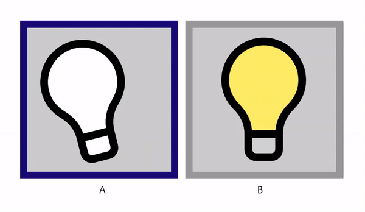

# The Asynchronous Play Method

So far, we’ve ignored the return value of the AnimatedVisualPlayer’s [PlayAsync](/uwp/api/microsoft.ui.xaml.controls.animatedvisualplayer.playasync) method: it returns an [IAsyncAction](/uwp/api/microsoft.ui.xaml.controls.animatedvisualplayer.playasync#returns) that completes when the animation reaches [toProgress](/uwp/api/microsoft.ui.xaml.controls.animatedvisualplayer.playasync#parameters) (if it isn’t also [looped](/uwp/api/microsoft.ui.xaml.controls.animatedvisualplayer.playasync#parameters)), or if the play is interrupted by the [Stop](/uwp/api/microsoft.ui.xaml.controls.animatedvisualplayer.stop) or [SetProgress](/uwp/api/microsoft.ui.xaml.controls.animatedvisualplayer.setprogress) methods, or if another [Source](/uwp/api/microsoft.ui.xaml.controls.animatedvisualplayer.source) is loaded into the player. By `await`ing the completion of PlayAsync, we can trigger application logic or playback other animation sequences in coordination with the current Lottie animation.

To demonstrate this, we use two AnimatedVisualPlayer instances with _LightBulb.json_ to create the following pattern of animation sequences:



```csharp
    private async Task PlayAnimationSequencesAsync()
    {
        // We await the completion of the PlayAsync method to create 
        // the following order of animation sequences: 
        // 1. A Hovered, then
        // 2. B Hovered, then
        // 3. A Clicked, then
        // 4. B Clicked, then
        // 5. A Hovered & B Hovered together, then
        // 6. A Clicked & B Clicked together.

        PlayerABorder.BorderBrush = _highlightedBrush;
        PlayerBBorder.BorderBrush = _disabledBrush;
        await PlayerA.PlayAsync(s_hoveredSegment.fromProgress, s_hoveredSegment.toProgress, s_hoveredSegment.looping);

        PlayerABorder.BorderBrush = _disabledBrush;
        PlayerBBorder.BorderBrush = _highlightedBrush;
        await PlayerB.PlayAsync(s_hoveredSegment.fromProgress, s_hoveredSegment.toProgress, s_hoveredSegment.looping);

        PlayerABorder.BorderBrush = _highlightedBrush;
        PlayerBBorder.BorderBrush = _disabledBrush;
        await PlayerA.PlayAsync(s_clickedSegment.fromProgress, s_clickedSegment.toProgress, s_clickedSegment.looping);

        PlayerABorder.BorderBrush = _disabledBrush;
        PlayerBBorder.BorderBrush = _highlightedBrush;
        await PlayerB.PlayAsync(s_clickedSegment.fromProgress, s_clickedSegment.toProgress, s_clickedSegment.looping);

        PlayerABorder.BorderBrush = _highlightedBrush;
        PlayerBBorder.BorderBrush = _highlightedBrush;
        await Task.WhenAll(PlayerA.PlayAsync(s_hoveredSegment.fromProgress, s_hoveredSegment.toProgress, s_hoveredSegment.looping).AsTask(),
                            PlayerB.PlayAsync(s_hoveredSegment.fromProgress, s_hoveredSegment.toProgress, s_hoveredSegment.looping).AsTask());

        PlayerABorder.BorderBrush = _highlightedBrush;
        PlayerBBorder.BorderBrush = _highlightedBrush;
        await Task.WhenAll(PlayerA.PlayAsync(s_clickedSegment.fromProgress, s_clickedSegment.toProgress, s_clickedSegment.looping).AsTask(),
                            PlayerB.PlayAsync(s_clickedSegment.fromProgress, s_clickedSegment.toProgress, s_clickedSegment.looping).AsTask());

        PlayerABorder.BorderBrush = _disabledBrush;
        PlayerBBorder.BorderBrush = _disabledBrush;
    }

```

If your scenario doesn’t require you to `await` the completion of PlayAsync, you may simply start the play and not keep track of it. In order to avoid a Visual Studio CS1998 compiler warning, we intentionally ignore the IAsyncAction returned from the PlayAsync method by using a [C# 7 discard](/dotnet/csharp/discards#a-standalone-discard) as follows:

```csharp
    // Play the animation once.
    _ = player.PlayAsync(fromProgress: 0, toProgress: 1, looped: false);
```

## Resources

* [Source code](https://github.com/windows-toolkit/Lottie-Windows/blob/rel/7.0.0/samples/LottieSamples/Scenarios/AsyncPage.xaml.cs) for sample: the asynchronous play method
* The resulting page in the [Lottie Samples application](https://aka.ms/lottiesamples)
* [PlayAsync](/uwp/api/microsoft.ui.xaml.controls.animatedvisualplayer.playasync) method
* [Help + feedback](https://github.com/windows-toolkit/Lottie-Windows/issues)
