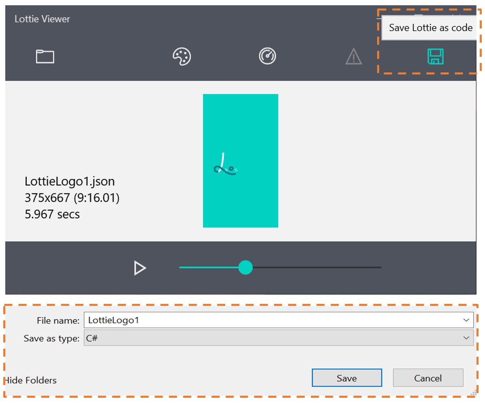

# Using Codegen

Consuming [Bodymovin](https://aescripts.com/bodymovin/) JSON files is the standard way of displaying Lottie animations on Web, Android, and iOS. However, this approach comes with the overhead of having to parse and translate JSON in your application’s process. You can get significant performance benefits by having Lottie-Windows generate the animation code as a C# or C++ class ahead of time, which may be used instead of the [LottieVisualSource](https://docs.microsoft.com/dotnet/api/microsoft.toolkit.uwp.ui.lottie.lottievisualsource). Both approaches, JSON and Codegen, have the same visual outcome but [different workflows and benefits](./json_codegen.md).

## Generating a C# or C++ class from JSON

To generate a C# or C++ file, you may either use the [LottieGen](http://aka.ms/lottiegen) command-line tool or the [Lottie Viewer](http://aka.ms/lottieviewer) application.

### LottieGen CLI

1. In your command-line interface, install the LottieGen tool from nuget:

    ```bash
    dotnet tool install -g LottieGen
    ```

2. Generate classes in your desired language as follows:

    ```bash
    LottieGen -InputFile LottieLogo1.json -Language cs
    ```

For additional information about additional options including optimizations, use `LottieGen -Help`.

### Lottie Viewer GUI

1. Install the [Lottie Viewer](http://aka.ms/lottieviewer) application from the Store. Drag and drop your JSON file, or use the the “Pick a Lottie file” icon in the top left to open local files or URIs.

2. Click the “Save Lottie as Code” icon in the top-right corner to generate C# or C++ classes. In the resulting Save As explorer window, select your destination folder, filename, and desired language.

	

## Using the Codegen File

1. Add the generated file, `LottieLogo1.cs`, to your VisualStudio Project Solution using steps similar to those outline previously. Ensure that the [Build Action](https://docs.microsoft.com/visualstudio/ide/build-actions) for all codegen C# or C++ files is set to **Compile**.

2. By default, all codegen classes are generated in the `AnimatedVisuals` namespace. Modify your Page.xaml to include the namespace:

    ```xaml
    xmlns:animatedvisuals="using:AnimatedVisuals"
    ```

3. Install the [Microsoft.UI.Xaml nuget package](https://www.nuget.org/packages/Microsoft.UI.Xaml/) which contains the [AnimatedVisualPlayer](https://docs.microsoft.com/uwp/api/microsoft.ui.xaml.controls.animatedvisualplayer) element. Modify your Page.xaml to include the namespace:

    ```xaml
    xmlns:controls="using:Microsoft.UI.Xaml.Controls"
    ```

4. Instantiate the [AnimatedVisualPlayer](https://docs.microsoft.com/uwp/api/microsoft.ui.xaml.controls.animatedvisualplayer) element and configure its [Source](https://docs.microsoft.com/uwp/api/microsoft.ui.xaml.controls.animatedvisualplayer.source) as follows:

    ```xaml
        <Border Style="{StaticResource LottiePlayer}">
            <!--AnimatedVisualPlayer with AutoPlay-->
            <controls:AnimatedVisualPlayer x:Name="LottiePlayer">
                <!--Codegen class AnimatedVisuals/LottieLogo1.cs-->
                <animatedvisuals:LottieLogo1/>
            </controls:AnimatedVisualPlayer>
        </Border>
    ```

This should result in a looping Lottie animation that is visually identical to our earlier approach of using a JSON file:


## Resources

* [Source code](https://github.com/windows-toolkit/Lottie-Windows/blob/master/samples/LottieSamples/Scenarios/CodegenPage.xaml) for sample: getting started with Codegen
* The resulting page in the [Lottie Samples application](http://aka.ms/lottiesamples)
* [LottieGen](http://aka.ms/lottiegen) CLI tool
* [Lottie Viewer](http://aka.ms/lottieviewer)  application for codegen and previewing JSON files
* A comparison of [JSON verus Codegen](./json_codegen.md)
* [Help + feedback](https://github.com/windows-toolkit/Lottie-Windows/issues)
