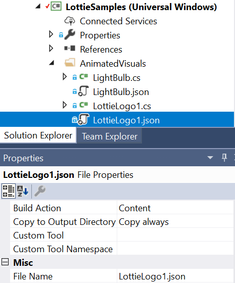

# Getting Started with Lottie-Windows

You probably have a JSON file that was exported from [Adobe AfterEffects](https://www.adobe.com/products/aftereffects.html) using the [BodyMovin](https://aescripts.com/bodymovin/) plugin. If not, you can find many from the [fantastic community](https://lottiefiles.com/) of Lottie designers and creators. Let’s bring these animations to your Windows applications with the following steps:

1. _(Optional but Recommended)_ Install the [Lottie Viewer](https://aka.ms/lottieviewer) application from the Store and validate that the JSON file — _LottieLogo1.json_ in this example — works as expected. If there are any known issues due to unsupported AfterEffects features, the warning icon may light up and provide more context.  

2. Install the [Microsoft.UI.Xaml nuget package](https://www.nuget.org/packages/Microsoft.UI.Xaml/) which contains the [AnimatedVisualPlayer](/uwp/api/microsoft.ui.xaml.controls.animatedvisualplayer) element. In your VisualStudio project:
    * Go to the Nuget Package Manager by navigating to Project > Manage Nuget Packages.
    * Check the _Include prerelease_ box and search for “Microsoft.UI.Xaml” in nuget.org.
    * Install the latest prerelease version of the nuget package available.

    Modify your Page.xaml to include the namespace:

    ```xaml
    xmlns:muxc="using:Microsoft.UI.Xaml.Controls"
    ```

3. Install the latest [Microsoft.Toolkit.Uwp.UI.Lottie nuget package](https://www.nuget.org/packages/Microsoft.Toolkit.Uwp.UI.Lottie/) by following steps similar to those listed above. Modify your Page.xaml to include the namespace:

    ```xaml
    xmlns:lottie="using:Microsoft.Toolkit.Uwp.UI.Lottie"
    ```

4. Add the JSON file to your project:
    * Add _LottieLogo1.json_ to the /AnimatedVisuals folder and include by right-clicking > Add > Existing Item.
    * Set its [Build Action](/visualstudio/ide/build-actions) to **Content** in the Properties window.

    

5. Instantiate the [AnimatedVisualPlayer](/uwp/api/microsoft.ui.xaml.controls.animatedvisualplayer) element and configure the [LottieVisualSource](/dotnet/api/microsoft.toolkit.uwp.ui.lottie.lottievisualsource) to be consumed:

    ```xaml
        <Border>
            <!--AnimatedVisualPlayer with AutoPlay-->
            <muxc:AnimatedVisualPlayer x:Name="LottiePlayer">
                <!--LottieVisualSource with JSON UriSource-->
                <lottie:LottieVisualSource x:Name="LottieJsonSource" UriSource="ms-appx:///AnimatedVisuals/LottieLogo1.json"/>
            </muxc:AnimatedVisualPlayer>
        </Border>
    ```

Since the [AutoPlay](/uwp/api/microsoft.ui.xaml.controls.animatedvisualplayer.autoplay) property is set to True by default, the result will be this looping animation:


## Resources

* [Source code](https://github.com/windows-toolkit/Lottie-Windows/blob/master/samples/LottieSamples/Scenarios/JsonPage.xaml) for sample: getting started with a JSON file
* The resulting page in the [Lottie Samples application](https://aka.ms/lottiesamples)
* [LottieVisualSource](/dotnet/api/microsoft.toolkit.uwp.ui.lottie.lottievisualsource) API reference
* [Lottie Viewer application](https://aka.ms/lottieviewer) for previewing JSON files
* [Help + feedback](https://github.com/windows-toolkit/Lottie-Windows/issues)
