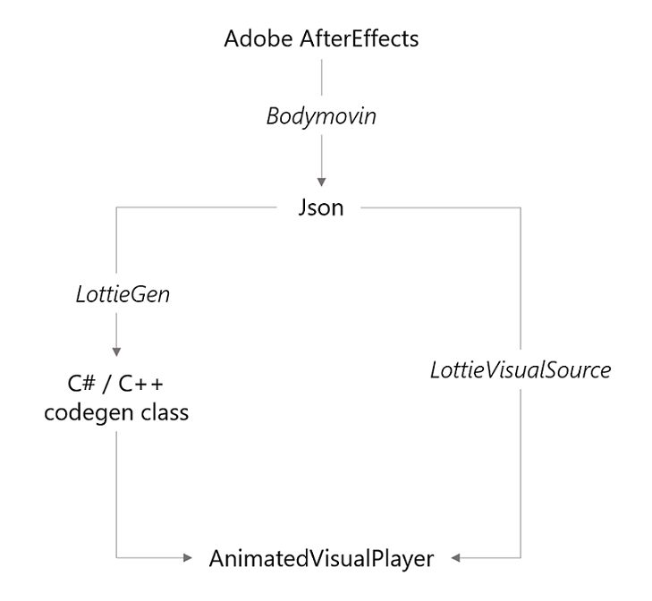

# JSON versus Codegen

Whether you choose to use a Bodymovin JSON file with a [LottieVisualSource](/dotnet/api/microsoft.toolkit.uwp.ui.lottie.lottievisualsource) or a codegen’ed C# or C++ class depends on your application’s requirements. Both types of sources are ultimately consumed by the [AnimatedVisualPlayer](/uwp/api/microsoft.ui.xaml.controls.animatedvisualplayer) element, but with slightly different workflows. Here’s an overview of how the pieces fit in:

The tradeoffs between using JSON and Codegen are as follows:

| JSON   | Codegen |
| -------- | ----------- |
| Can be loaded from a URI at run-time &mdash; this enables Lottie animations to be updated over the network, without updating the application. | Better performance: there is no need to parse and translate JSON at run-time on the application’s UI thread, and, since the resulting Windows.UI.Composition tree is generated ahead of time, it can be better optimized. |
| | Allows dynamic modification of Lottie animations by editing the generated Windows.UI.Composition Visual tree. This is useful for theming, branding, accessibility, etc. (see [related scenario sample](https://github.com/windows-toolkit/Lottie-Windows/blob/master/samples/LottieSamples/Scenarios/ModifyPage.xaml)).