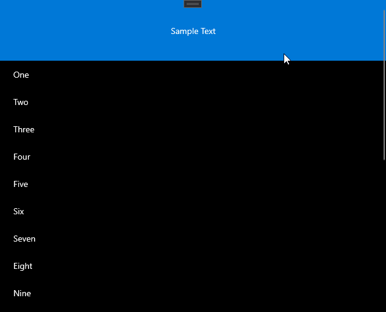

# Header Behaviors

The [FadeHeaderBehavior](/dotnet/api/microsoft.toolkit.uwp.ui.behaviors.fadeheaderbehavior), [QuickReturnHeaderBehavior](/dotnet/api/microsoft.toolkit.uwp.ui.behaviors.quickreturnheaderbehavior), and [StickyHeaderBehavior](/dotnet/api/microsoft.toolkit.uwp.ui.behaviors.stickyheaderbehavior) apply behaviors to ListView and GridView Headers.

The [FadeHeaderBehavior](/dotnet/api/microsoft.toolkit.uwp.ui.behaviors.fadeheaderbehavior) causes the Header of a ListView or GridView to fade in and out as the user scrolls to the top of the ListView or GridView.

The [QuickReturnHeaderBehavior](/dotnet/api/microsoft.toolkit.uwp.ui.behaviors.quickreturnheaderbehavior) causes the Header of a ListView or GridView to scroll into view as soon as the user scrolls up even if they are not near the of the ListView or GridView.

The [StickyHeaderBehavior](/dotnet/api/microsoft.toolkit.uwp.ui.behaviors.stickyheaderbehavior) causes the Header of a ListView or GridView to stay in view as the user scrolls up and down in the ListView or GridView.

> **Platform APIs:** [FadeHeaderBehavior](/dotnet/api/microsoft.toolkit.uwp.ui.behaviors.fadeheaderbehavior), [QuickReturnHeaderBehavior](/dotnet/api/microsoft.toolkit.uwp.ui.behaviors.quickreturnheaderbehavior), [StickyHeaderBehavior](/dotnet/api/microsoft.toolkit.uwp.ui.behaviors.stickyheaderbehavior)

> [!div class="nextstepaction"]
> [Try it in the sample app](uwpct://Controls?sample=ScrollHeader)

## Example

This is an example using the `FadeHeaderBehavior` the header will fade in and out of view when scrolling.

```xaml
<ListView Name="listView">
    <interactivity:Interaction.Behaviors>
        <behaviors:FadeHeaderBehavior />
    </interactivity:Interaction.Behaviors>
    <ListView.Header>
        <Grid MinHeight="100" Background="#FF0078D7">
            <TextBlock HorizontalAlignment="Center" VerticalAlignment="Center" Text="Sample Text"/>
        </Grid>
    </ListView.Header>
    <ListView.ItemTemplate>
        <DataTemplate x:DataType="x:String">
            <Grid MinHeight="25" Margin="10">
                <TextBlock Text="{Binding}" VerticalAlignment="Center" />
            </Grid>
        </DataTemplate>
    </ListView.ItemTemplate>
    <ListView.Items>
        <x:String>One</x:String>
        <x:String>Two</x:String>
        <x:String>Three</x:String>
        <x:String>Four</x:String>
        <x:String>Five</x:String>
        <x:String>Six</x:String>
        <x:String>Seven</x:String>
        <x:String>Eight</x:String>
        <x:String>Nine</x:String>
        <x:String>Ten</x:String>
        <x:String>Eleven</x:String>
        <x:String>Twelve</x:String>
        <x:String>Thirteen</x:String>
        <x:String>Fourteen</x:String>
        <x:String>Fifteen</x:String>
        <x:String>Sixteen</x:String>
        <x:String>Seventeen</x:String>
        <x:String>Eighteen</x:String>
        <x:String>Nineteen</x:String>
        <x:String>Twenty</x:String>
    </ListView.Items>
</ListView>
```

## Example Output



## Sample Project

[ScrollHeader](https://github.com/windows-toolkit/WindowsCommunityToolkit/tree/rel/7.0.0/Microsoft.Toolkit.Uwp.SampleApp/SamplePages/ScrollHeader). You can [see this in action](uwpct://Controls?sample=ScrollHeader) in [Windows Community Toolkit Sample App](https://aka.ms/windowstoolkitapp).

## Source Code

- [Header behaviors source code](https://github.com/windows-toolkit/WindowsCommunityToolkit/tree/rel/7.0.0/Microsoft.Toolkit.Uwp.UI.Behaviors/Headers)

## Related Topics

- [XAML Behaviors](https://github.com/microsoft/XamlBehaviors/wiki)
