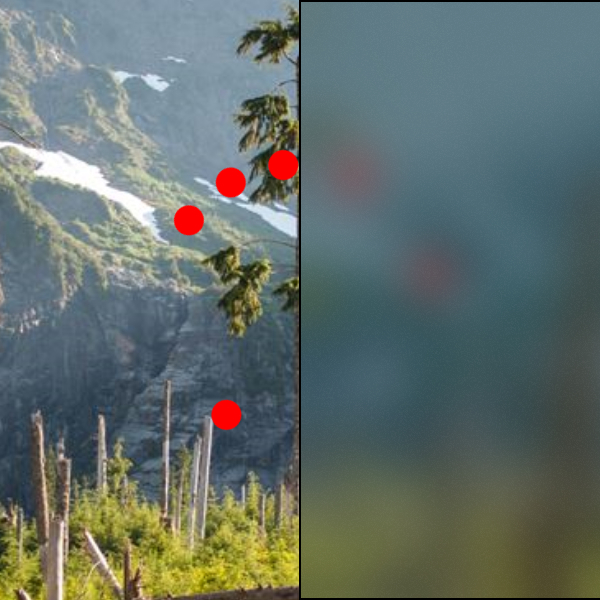

# PipelineBrush

The [PipelineBrush](/dotnet/api/microsoft.toolkit.uwp.ui.media.pipelinebrush) is a [Brush](/uwp/api/windows.ui.xaml.media.brush) which can render any custom Win2D/Composition effects chain.

> [!div class="nextstepaction"]
> [Try it in the sample app](uwpct://Brushes?sample=PipelineBrush)

## Syntax

```xaml
<Border BorderBrush="Black" BorderThickness="1" VerticalAlignment="Center" HorizontalAlignment="Center" Width="400" Height="400">
  <Border.Background>
    <media:PipelineBrush Source="{effects:BackdropSource}">
      <effects:LuminanceToAlphaEffect/>
      <effects:OpacityEffect Value="0.4"/>
      <effects:BlendEffect
        Mode="Multiply"
        Source="{effects:BackdropSource}"/>
      <effects:BlurEffect Value="16"/>
      <effects:ShadeEffect Color="#FF222222" Intensity="0.2"/>
      <effects:BlendEffect
        Mode="Overlay"
        Placement="Foreground"
        Source="{effects:TileSource Uri=ms-appx:///Assets/BrushAssets/NoiseTexture.png}"/>
    </brushes:PipelineBrush>
  </Border.Background>
</Border>
```

## Example Image



## Properties

| Property | Type | Description |
| -- | -- | -- |
| Source | PipelineBuilder | The source for the current pipeline |
| Effects | IList\<IPipelineEffect> | The collection of effects to use in the current pipeline. |

## Code behind support

The pipelines of effects that can be built from XAML through the `PipelineBrush` type can also be created directly from code behind through the `PipelineBuilder` class.

```csharp
Brush brush =
  PipelineBuilder
    .FromBackdrop()
    .LuminanceToAlpha()
    .Opacity(0.4f)
    .Blend(
      PipelineBuilder.FromBackdrop(),
      BlendEffectMode.Multiply)
    .Blur(16)
    .Shade("#FF222222".ToColor(), 0.4f)
    .Blend(
      PipelineBuilder.FromTiles("/Assets/BrushAssets/NoiseTexture.png"),
      BlendEffectMode.Overlay,
      Placement.Foreground)
    .AsBrush();
```

## Sample Project

[PipelineBrush sample page Source](https://github.com/windows-toolkit/WindowsCommunityToolkit/tree/rel/7.0.0/Microsoft.Toolkit.Uwp.SampleApp/SamplePages/PipelineBrush). You can [see this in action](uwpct://Brushes?sample=PipelineBrush) in the [Windows Community Toolkit Sample App](https://aka.ms/windowstoolkitapp).

## Requirements

| Device family | Universal, 10.0.17134.0 or higher |
| --- | --- |
| Namespace | Microsoft.Toolkit.Uwp.UI.Media |
| NuGet package | [Microsoft.Toolkit.Uwp.UI.Media](https://www.nuget.org/packages/Microsoft.Toolkit.Uwp.UI.Media/) |

## API

* [PipelineBrush source code](https://github.com/windows-toolkit/WindowsCommunityToolkit/blob/rel/7.0.0/Microsoft.Toolkit.Uwp.UI.Media/Brushes/PipelineBrush.cs)
* [PipelineBuilder source code](https://github.com/windows-toolkit/WindowsCommunityToolkit/blob/rel/7.0.0/Microsoft.Toolkit.Uwp.UI.Media/Pipelines/PipelineBuilder.cs)

## Related Topics

* [Win2D GaussianBlurEffect reference](https://microsoft.github.io/Win2D/html/T_Microsoft_Graphics_Canvas_Effects_GaussianBlurEffect.htm)
* [XamlCompositionBrushBase Examples](/uwp/api/windows.ui.xaml.media.xamlcompositionbrushbase#examples)
