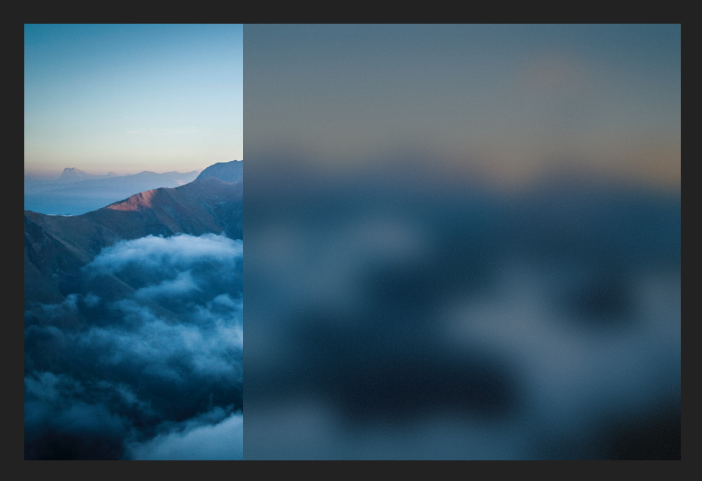

# PipelineVisualFactory

The [`PipelineVisualFactory`](/dotnet/api/microsoft.toolkit.uwp.ui.media.PipelineVisualFactory) is a helper type that can be used to create sprite visuals with custom Win2D/Composition effects chains and attach them to UI elements. It can create the same visual brushes as the [`PipelineBrush`](/dotnet/api/microsoft.toolkit.uwp.ui.media.pipelinebrush) type, but it can attach them directly on the underlying [`Visual`](/uwp/api/windows.ui.composition.visual) instance backing a UI element. This can make the XAML code less verbose and more efficient, as there is no need to insert additional elements just so that a brush can be applied to them.

> **Platform APIs:** [`PipelineVisualFactory`](/dotnet/api/microsoft.toolkit.uwp.ui.media.PipelineVisualFactory), [`PipelineBrush`](/dotnet/api/microsoft.toolkit.uwp.ui.media.pipelinebrush)

## Syntax

```xaml
<Grid Height="480" Width="720">
    <Grid.Background>
        <ImageBrush ImageSource="/Assets/landscape.jpg" Stretch="UniformToFill"/>
    </Grid.Background>

    <Border
        VerticalAlignment="Center"
        HorizontalAlignment="Right"
        Height="480"
        Width="480">
        <media:UIElementExtensions.VisualFactory>
            <media:PipelineVisualFactory Source="{media:BackdropSource}">
                <media:LuminanceToAlphaEffect/>
                <media:OpacityEffect Value="0.4"/>
                <media:BlendEffect Mode="Multiply" Source="{media:BackdropSource}"/>
                <media:BlurEffect Amount="16"/>
                <media:ShadeEffect Color="#FF222222" Intensity="0.2"/>
                <media:BlendEffect Mode="Overlay" Placement="Foreground" Source="{media:TileSource Uri=ms-appx:///Assets/NoiseTexture.png}"/>
            </media:PipelineVisualFactory>
        </media:UIElementExtensions.VisualFactory>
    </Border>
</Grid>
```

## Example Image



## Examples

You can find more examples in the [sample app](https://github.com/windows-toolkit/WindowsCommunityToolkit/tree/rel/7.1.0/Microsoft.Toolkit.Uwp.SampleApp).
