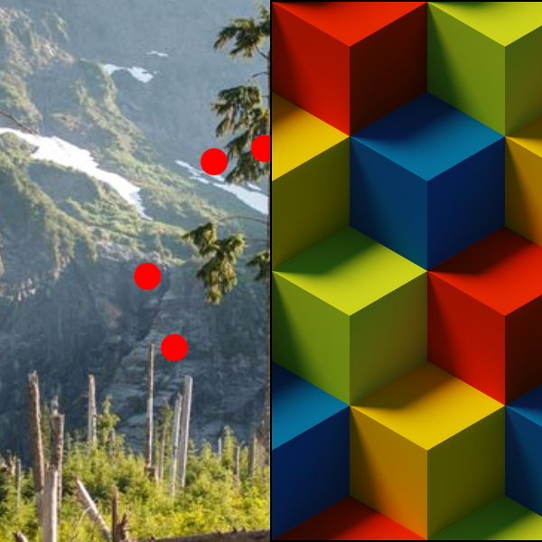

# TilesBrush

The [TilesBrush](/dotnet/api/microsoft.toolkit.uwp.ui.media.tilesbrush) is a [Brush](/uwp/api/windows.ui.xaml.media.brush) that that displays a tiled image.

> [!div class="nextstepaction"]
> [Try it in the sample app](uwpct://Brushes?sample=TilesBrush)

## Syntax

```xml
<Border BorderBrush="Black" BorderThickness="1" VerticalAlignment="Center" HorizontalAlignment="Center" Width="400" Height="400">
  <Border.Background>
    <brushes:TilesBrush TextureUri="ms-appx:///Assets/BrushAssets/TileTexture.png"/>
  </Border.Background>
</Border>
```

## Example Image



## Properties

| Property | Type | Description |
| -- | -- | -- |
| TextureUri | Uri | The `Uri` for the texture to use. |
| DpiMode | DpiMode | The DPI mode used to render the texture (the default is `DpiMode.DisplayDpiWith96AsLowerBound`) |

## Code behind support

This brush can be also be built from code behind through the `PipelineBuilder` class.

```csharp
Brush brush = PipelineBuilder.FromTiles("/Assets/BrushAssets/NoiseTexture.png".ToAppxUri()).AsBrush();
```

## Sample Project

[TilesBrush sample page Source](https://github.com/Microsoft/WindowsCommunityToolkit//tree/master/Microsoft.Toolkit.Uwp.SampleApp/SamplePages/TilesBrush). You can [see this in action](uwpct://Brushes?sample=TilesBrush) in the [Windows Community Toolkit Sample App](http://aka.ms/uwptoolkitapp).

## Requirements

| Device family | Universal, 10.0.17134.0 or higher |
| --- | --- |
| Namespace | Microsoft.Toolkit.Uwp.UI.Media |
| NuGet package | [Microsoft.Toolkit.Uwp.UI.Media](https://www.nuget.org/packages/Microsoft.Toolkit.Uwp.UI.Media/) |

## API

* [TilesBrush source code](https://github.com/windows-toolkit/WindowsCommunityToolkit/blob/master/Microsoft.Toolkit.Uwp.UI.Media/Brushes/TilesBrush.cs)
* [PipelineBuilder source code](https://github.com/windows-toolkit/WindowsCommunityToolkit/blob/master/Microsoft.Toolkit.Uwp.UI.Media/Pipelines/PipelineBuilder.cs)

## Related Topics

* [XamlCompositionBrushBase Examples](/uwp/api/windows.ui.xaml.media.xamlcompositionbrushbase#examples)