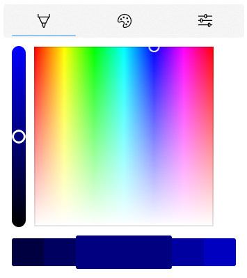

# ColorPicker XAML Control

<!-- Describe your control -->
The [ColorPicker](/dotnet/api/microsoft.toolkit.uwp.ui.controls.colorpicker) control lets a user pick a color using a color spectrum, palette, sliders, or text input.

There is also a `DropDownButton` version of the control named `ColorPickerButton` which provides a preview of the selected color and allows a user to expand the drop-down to select a new color.

> **Platform APIs:** [`ColorPicker`](/dotnet/api/microsoft.toolkit.uwp.ui.controls.colorpicker), [`ColorPickerButton`](/dotnet/api/microsoft.toolkit.uwp.ui.controls.colorpickerbutton)

> [!div class="nextstepaction"]
> [Try it in the sample app](uwpct://Controls?sample=ColorPicker)

## Example

```xaml
  <controls:ColorPicker Color="Navy"/>
```

## Example Output

  

## Sample Project

<!-- Link to the sample page in the Windows Community Toolkit Sample App -->
[ColorPicker sample page Source](https://github.com/windows-toolkit/WindowsCommunityToolkit/tree/rel/7.0.0/Microsoft.Toolkit.Uwp.SampleApp/SamplePages/ColorPicker). You can [see this in action](uwpct://Controls?sample=ColorPicker) in [Windows Community Toolkit Sample App](https://aka.ms/windowstoolkitapp).

## Source Code

- [ColorPicker source code](https://github.com/windows-toolkit/WindowsCommunityToolkit/tree/rel/7.0.0/Microsoft.Toolkit.Uwp.UI.Controls.Input/ColorPicker)

<!-- Optional -->

## Related Topics

- [ColorPicker Design Guidance](/windows/uwp/design/controls-and-patterns/color-picker)
- [WinUI ColorPicker API Doc](/windows/winui/api/microsoft.ui.xaml.controls.colorpicker)
