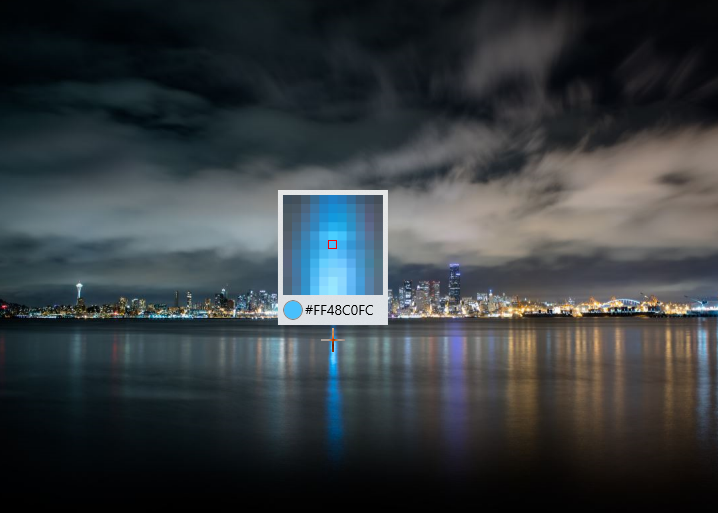

# Eyedropper

The [Eyedropper](https://docs.microsoft.com/dotnet/api/microsoft.toolkit.uwp.ui.controls.eyedropper) control can pick up a color from anywhere in your application.

> [!NOTE]
> The Eyedropper Control uses [RenderTargetBitmap](https://docs.microsoft.com/uwp/api/windows.ui.xaml.media.imaging.rendertargetbitmap) to get a screenshot of your app. In some cases, RenderTargetBitmap may render incorrectly, which will cause eyedropper not to get the correct color value. Please make sure your xaml layout is reasonable, see [here](https://docs.microsoft.com/uwp/api/windows.ui.xaml.media.imaging.rendertargetbitmap#xaml-visuals-and-rendertargetbitmap-capture-capabilities) for details.

> [!div class="nextstepaction"]
> [Try it in the sample app](uwpct://Controls?sample=Eyedropper)

## Syntax

Use EyedropperToolButton in xaml.

```xaml
<Page ...
     xmlns:controls="using:Microsoft.Toolkit.Uwp.UI.Controls"/>
    <controls:EyedropperToolButton />
</Page>
```

Or use the global Eyedropper in code.

```csharp
var eyedropper = new Eyedropper();
var color = await eyedropper.Open();
```
```vb
Dim eyedropper = New Eyedropper()
Dim color = Await eyedropper.Open()
```

## Sample Output



## Properties

### Eyedropper Properties

| Property | Type        | Description                                      |
| -------- | ----------- | ------------------------------------------------ |
| Color    | Color       | Gets the current color value.                    |
| Preview  | ImageSource | Gets the enlarged pixelated preview image.       |
| WorkArea | Rect        | Gets or sets the working area of the eyedropper. |

### EyedropperToolButton Properties

| Property          | Type             | Description                                                  |
| ----------------- | ---------------- | ------------------------------------------------------------ |
| Color             | Color            | Gets the current color value.                                |
| EyedropperEnabled | bool             | Gets or sets a value indicating whether eyedropper is opened. |
| EyedropperStyle   | Style            | Gets or sets a value for the style to use for the eyedropper. |
| TargetElement     | FrameworkElement | Gets or sets the working target element of the eyedropper.   |

## Methods

### Eyedropper Methods

| Methods        | Return Type | Description           |
| -------------- | ----------- | --------------------- |
| Open([Point?]) | Task<Color> | Open the eyedropper.  |
| Close()        | void        | Close the eyedropper. |

## Events

### Eyedropper Events

| Events        | Description                                      |
| ------------- | ------------------------------------------------ |
| ColorChanged  | Occurs when the Color property has changed.      |
| PickStarted   | Occurs when the eyedropper begins to take color. |
| PickCompleted | Occurs when the eyedropper stops to take color.  |

### EyedropperToolButton Events

| Events        | Description                                      |
| ------------- | ------------------------------------------------ |
| ColorChanged  | Occurs when the Color property has changed.      |
| PickStarted   | Occurs when the eyedropper begins to take color. |
| PickCompleted | Occurs when the eyedropper stops to take color.  |

## Examples

- Use the global Eyedropper in code.

```csharp
var eyedropper = new Eyedropper();
var color = await eyedropper.Open();
```
```vb
Dim eyedropper = New Eyedropper()
Dim color = Await eyedropper.Open()
```

## Sample Project

[Eyedropper Sample Page Source](https://github.com/Microsoft/WindowsCommunityToolkit//tree/master/Microsoft.Toolkit.Uwp.SampleApp/SamplePages/Eyedropper). You can [see this in action](uwpct://Controls?sample=Eyedropper) in the [Windows Community Toolkit Sample App](https://aka.ms/uwptoolkitapp).

## Default Template

[Eyedropper XAML File](https://github.com/Microsoft/WindowsCommunityToolkit//blob/master/Microsoft.Toolkit.Uwp.UI.Controls/DropShadowPanel/Eyedropper.xaml) is the XAML template used in the toolkit for the default styling.

## Requirements

| Device family | Universal, 10.0.16299.0 or higher                            |
| ------------- | ------------------------------------------------------------ |
| Namespace     | Microsoft.Toolkit.Uwp.UI.Controls                            |
| NuGet package | [Microsoft.Toolkit.Uwp.UI.Controls](https://www.nuget.org/packages/Microsoft.Toolkit.Uwp.UI.Controls/) |

## API

* [Eyedropper source code](https://github.com/Microsoft/WindowsCommunityToolkit//tree/master/Microsoft.Toolkit.Uwp.UI.Controls/Eyedropper)