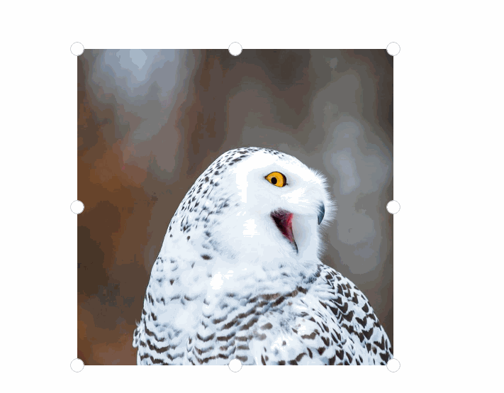

# ImageCropper XAML Control

The [ImageCropper Control](https://docs.microsoft.com/dotnet/api/microsoft.toolkit.uwp.ui.controls.imagecropper) allows user to crop image freely.

> [!div class="nextstepaction"]
> [Try it in the sample app](uwpct://Controls?sample=ImageCropper)

## Syntax

```xaml
<Page ...
     xmlns:controls="using:Microsoft.Toolkit.Uwp.UI.Controls"/>
    <controls:ImageCropper x:Name="ImageCropper" />
</Page>
```

## Sample Output



## Properties

| Property              | Type            | Description                                                  |
| --------------------- | --------------- | ------------------------------------------------------------ |
| MinCroppedPixelLength | double          | Gets or sets the minimum cropped length(in pixel).           |
| MinSelectedLength     | double          | Gets or sets the minimum selectable length.                  |
| CroppedRegion         | Rect            | Gets the current cropped region.                             |
| Source                | WriteableBitmap | Gets or sets the source of the cropped image.                |
| AspectRatio           | double?         | Gets or sets the aspect ratio of the cropped image, the default value is null. |
| CropShape             | CropShape       | Gets or sets the shape to use when cropping.                 |
| Mask                  | Brush           | Gets or sets the mask on the cropped image.                  |
| PrimaryThumbStyle     | Style           | Gets or sets a value for the style to use for the primary thumbs of the ImageCropper. |
| SecondaryThumbStyle   | Style           | Gets or sets a value for the style to use for the secondary thumbs of the ImageCropper. |
| ThumbPlacement        | ThumbPlacement  | Gets or sets a value for thumb placement.                    |

## Methods

| Methods                                              | Return Type | Description                                                  |
| ---------------------------------------------------- | ----------- | ------------------------------------------------------------ |
| LoadImageFromFile(StorageFile)                       | Task        | Load an image from a file.                                   |
| SaveAsync(IRandomAccessStream,BitmapFileFormat,bool) | Task        | Saves the cropped image to a stream with the specified format. Setting the boolean argument to True will save pixel values to the extent of the cropped area regardless of the crop shape, otherwise transparent or black pixels will fill the uncropped area depending on file format. |
| Reset()                                              | void        | Reset the cropped area.                                      |
| TrySetCroppedRegion(Rect rect)                       | bool        | Tries to set a new value for the cropped region, returns true if it succeeded, false if the region is invalid  |

## Examples

### Use ImageCropper

You can set the cropped image source by using the `LoadImageFromFile(StorageFile)` method or setting the `Source` property.

```csharp
//Load an image.
await ImageCropper.LoadImageFromFile(file);

//Another way to load an image.
ImageCropper.Source = writeableBitmap;

//Saves the cropped image to a stream.
using (var fileStream = await someFile.OpenAsync(FileAccessMode.ReadWrite, StorageOpenOptions.None))
{
    await _imageCropper.SaveAsync(fileStream, BitmapFileFormat.Png);
}
```

```vb
' Load an image.
Await ImageCropper.LoadImageFromFile(file)

' Another way to load an image.
ImageCropper.Source = writeableBitmap

' Saves the cropped image to a stream.
Using fileStream = Await someFile.OpenAsync(FileAccessMode.ReadWrite, StorageOpenOptions.None)
    Await _imageCropper.SaveAsync(fileStream, BitmapFileFormat.Png)
End Using
```

### Use Circular ImageCropper

You can set `CropShape` property to use the circular ImageCropper.

```csharp
ImageCropper.CropShape = CropShape.Circular;
```

```vb
ImageCropper.CropShape = CropShape.Circular
```

### Change Aspect Ratio

You can set `AspectRatio` property to change the aspect ratio of the cropped image.

```csharp
ImageCropper.AspectRatio = 16d / 9d;
```

```vb
ImageCropper.AspectRatio = 16R / 9R
```

Or you can crop image without aspect ratio.

```csharp
ImageCropper.AspectRatio = null;
```

```vb
ImageCropper.AspectRatio = Nothing
```

## Sample Project

[ImageCropper Sample Page Source](https://github.com/Microsoft/WindowsCommunityToolkit//tree/master/Microsoft.Toolkit.Uwp.SampleApp/SamplePages/ImageCropper). You can [see this in action](uwpct://Controls?sample=ImageCropper) in the [Windows Community Toolkit Sample App](https://aka.ms/uwptoolkitapp).

## Default Template

[ImageCropper XAML File](https://github.com/Microsoft/WindowsCommunityToolkit//blob/master/Microsoft.Toolkit.Uwp.UI.Controls/ImageCropper/ImageCropper.xaml) is the XAML template used in the toolkit for the default styling.

## Requirements

| Device family | Universal, 10.0.16299.0 or higher |
| -- | -- |
| Namespace | Microsoft.Toolkit.Uwp.UI.Controls |
| NuGet package | [Microsoft.Toolkit.Uwp.UI.Controls](https://www.nuget.org/packages/Microsoft.Toolkit.Uwp.UI.Controls/)  |

## API

* [ImageCropper source code](https://github.com/Microsoft/WindowsCommunityToolkit//tree/master/Microsoft.Toolkit.Uwp.UI.Controls/ImageCropper)
