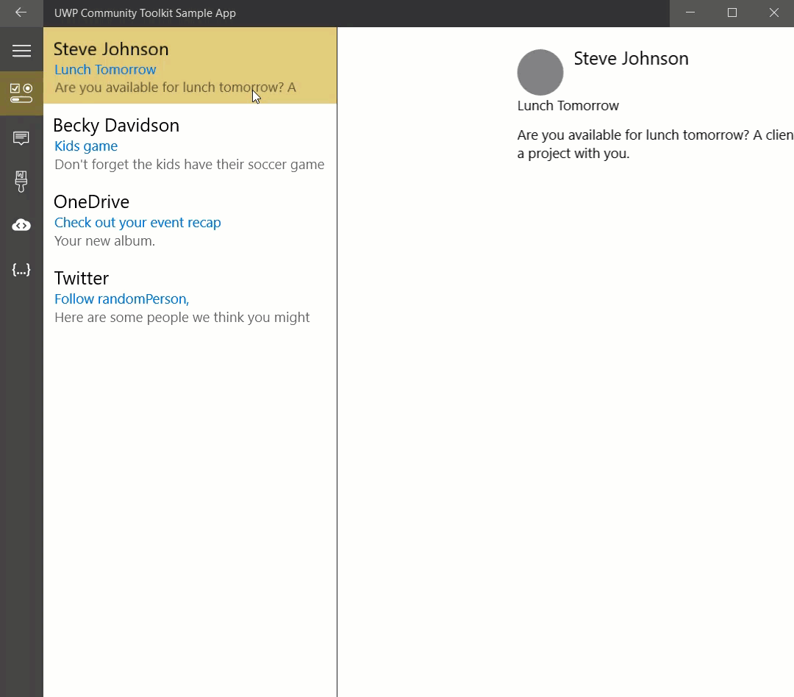

# ListDetailsView

The [ListDetailsView](/dotnet/api/microsoft.toolkit.uwp.ui.controls.listdetailsview) control presents items in a list/details pattern. It shows a collection of items within the "list panel" and the details for that item within the "details panel". The ListDetailsView reacts to the width it is given to determine if it should show both the list and details or just one of the two. There is a dependency property `ViewState` or an event `ViewStateChanged` that can be used to track which state the control is in.

> **Platform APIs:** [`ListDetailsView`](/dotnet/api/microsoft.toolkit.uwp.ui.controls.listdetailsview), [`ListDetailsViewState`](/dotnet/api/microsoft.toolkit.uwp.ui.controls.listdetailsviewstate)

> [!div class="nextstepaction"]
> [Try it in the sample app](uwpct://Controls?sample=ListDetailsView)

## Syntax

```xaml
<controls:ListDetailsView
          ItemsSource="{Binding Items}"
          ItemTemplate="{StaticResource ListTemplate}"
          DetailsTemplate="{StaticResource DetailsTemplate}"
          NoSelectionContentTemplate="{StaticResource NoSelectionContentTemplate}"
          CompactModeThresholdWidth="720" />
```

## Sample Output



## BackButtonBehavior

When in compact mode, the `ListDetailsView` will either show the List or the Details view, not both. If an item is selected, the control will *navigate* forward to the Details view. If the CurrentItem is set to `null`, the control will navigate *back* to the List view.

If there is a Frame in the parent visual tree, the ListDetailsView control will use the Frame navigation events to transition from the Details view to the List view. If the host Frame is attempting back navigation while the Details view state is active, the ListDetailsView will transition to the the List view and cancel the back navigation.

To help with back navigation, The ListDetailsView can handle back button visibility of the SystemNavigationManager back button, a parent NavigationView back button, or an inline back button. Use the `BackButtonBehavior` property to control the behavior:

- `Automatic` will let the control decide which back button to make visible/enabled.
  - If the system back button is visible the control won't use any other buttons
  - Else, if the control parent tree contains a Frame hosted in a NavigationView, the NavigationView back button will be used
  - Otherwise, an inline button will be used
- `System` will use the system back button controlled by the SystemNavigationManager. The control will make the button visible (if not already visible) when in the Details view and restore the visibility when transitioning to the List view. This is the default value.
- `Inline` will use a back button built into the control
- `Manual` will not enable any back buttons (if using a custom button).

## Sample Project

[ListDetailsView Sample Page Source](https://github.com/windows-toolkit/WindowsCommunityToolkit/tree/rel/7.0.0/Microsoft.Toolkit.Uwp.SampleApp/SamplePages/ListDetailsView). You can [see this in action](uwpct://Controls?sample=ListDetailsView) in the [Windows Community Toolkit Sample App](https://aka.ms/windowstoolkitapp).

## Default Template

[ListDetailsView XAML File](https://github.com/windows-toolkit/WindowsCommunityToolkit/blob/rel/7.0.0/Microsoft.Toolkit.Uwp.UI.Controls.Layout/ListDetailsView/ListDetailsView.xaml) is the XAML template used in the toolkit for the default styling.

## API

- [ListDetailsView source code](https://github.com/windows-toolkit/WindowsCommunityToolkit/tree/rel/7.0.0/Microsoft.Toolkit.Uwp.UI.Controls.Layout/ListDetailsView)
