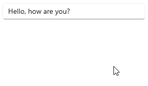

# RichSuggestBox

The [RichSuggestBox](/dotnet/api/microsoft.toolkit.uwp.ui.controls.richsuggestbox) is a combination of [AutoSuggestBox](/uwp/api/windows.ui.xaml.controls.autosuggestbox) and [RichEditBox](/uwp/api/windows.ui.xaml.controls.richeditbox) that can provide suggestions based on customizable prefixes. Selected suggestions are then embedded and tracked in the document as tokens.

RichSuggestBox resembles text controls commonly found in social applications where you type "@" to mention people.
<!-- Your API link will be in a form like: /dotnet/api/microsoft.toolkit.uwp.helpers.printhelper 
with the namespace and the class name. Without any country/region 'en-us' identifiers, the root domain, or query string views.
-->


<!-- Use below format to display note
> [!NOTE]
> Some note

> [!IMPORTANT]
> Some important note

> [!WARNING]
> Some warning note
-->

> **Platform APIs:** [`RichSuggestBox`](/dotnet/api/microsoft.toolkit.uwp.ui.controls.richsuggestbox)

> [!div class="nextstepaction"]
> [Try it in the sample app](uwpct://Controls?sample=RichSuggestBox)

## Syntax

```xaml
<controls:RichSuggestBox
  PlaceholderText="Leave a comment"
  ItemTemplate="{StaticResource SuggestionTemplate}"
  Prefixes="@#" />
```

## Example Output



## Remarks

When a suggestion is selected, `RichSuggestBox` assigns the selected item a unique [Guid](/dotnet/api/system.guid) and a display text (provided by the developer) to make up a token. The display text is then padded with [Zero Width Space](https://unicode-table.com/200B/)s (ZWSP) and inserted into the document as a hyperlink using the identifier as the link address. These hyperlinks are tracked and validated on every text change.

The token text inserted into the document has the following layout: ZWSP - Prefix character - Display text - ZWSP.

For example, a token with "@" as the prefix and "John Doe" as the display text is inserted as:
```cs
"\u200b@John Doe\u200b"
```

> [!IMPORTANT]
> Token text contains [Zero Width Space](https://unicode-table.com/200B/)s, which are Unicode characters.

> [!NOTE]
> To support Undo/Redo function, `RichSuggestBox` keeps all the tokens in an internal collection even when the token text is deleted from the document. These token are marked as inactive and are not included in the `Tokens` collection. Use `ClearUndoRedoSuggestionHistory()` method to clear inactive tokens or `Clear()` method to clear all tokens.

## Properties

| Property | Type | Description |
| -- | -- | -- |
| ClipboardCopyFormat | RichEditClipboardFormat | Gets or sets a value that specifies whether text is copied with all formats, or as plain text only. |
| ClipboardPasteFormat | RichEditClipboardFormat | Gets or sets a value that specifies whether pasted text preserves all formats, or as plain text only. |
| Description | object | Gets or sets content that is shown below the control. The content should provide guidance about the input expected by the control. |
| DisabledFormattingAccelerators | DisabledFormattingAccelerators | Gets or sets a value that indicates which keyboard shortcuts for formatting are disabled. |
| Header | object | Gets or sets the content for the control's header. |
| HeaderTemplate | DataTemplate | Gets or sets the `DataTemplate` used to display the content of the control's header. |
| HorizontalOffset | double | Gets the distance the content has been scrolled horizontally from the underlying `ScrollViewer`. |
| PlaceholderText | string | Gets or sets the text that is displayed in the control until the value is changed by a user action or some other operation. |
| PopupCornerRadius | CornerRadius | Gets or sets the radius for the corners of the popup control's border. |
| PopupFooter | object | Gets or sets the content for the suggestion popup control's footer. |
| PopupFooterTemplate | DataTemplate | Gets or sets the `DataTemplate` used to display the content of the suggestion popup control's footer. |
| PopupHeader | object | Gets or sets the content for the suggestion popup control's header. |
| PopupHeaderTemplate | DataTemplate | Gets or sets the `DataTemplate` used to display the content of the suggestion popup control's header. |
| PopupPlacement | SuggestionPopupPlacementMode | Gets or sets suggestion popup placement to either `Floating` or `Attached` to the text box. |
| Prefixes | string | Gets or sets prefix characters to start a query.<br />Prefix characters must be punctuations (must satisfy [IsPunctuation(Char)](/dotnet/api/system.char.ispunctuation) method). |
| RichEditBoxStyle | Style | Gets or sets the style of the underlying `RichEditBox`. |
| TextDocument | RichEditTextDocument | Gets an object that enables access to the text object model for the text contained in a `RichEditBox`. |
| TokenBackground | SolidColorBrush | Gets or sets the default brush used to color the suggestion token background. |
| TokenForeground | SolidColorBrush | Gets or sets the default brush used to color the suggestion token foreground. |
| Tokens | ReadOnlyObservableCollection\<RichSuggestToken\> | Gets a collection of suggestion tokens that are present in the document. |
| VerticalOffset | double | Gets the distance the content has been scrolled vertically from the underlying `ScrollViewer`. |

## Methods

| Methods | Return Type | Description |
| -- | -- | -- |
| AddTokens(IEnumerable\<RichSuggestToken\>) | void | Add tokens to be tracked against the document. Duplicate tokens will not be updated. |
| Clear() | void | Clear the document and token list. This will also clear the undo/redo history. |
| ClearUndoRedoSuggestionHistory() | void | Clear unused tokens and undo/redo history. |
| GetRectFromRange(ITextRange) | Rect | Retrieves the bounding rectangle that encompasses the text range with position measured from the top left of the `RichSuggestBox` control. |
| Load(string, IEnumerable\<RichSuggestToken\>) | void | Populate the `RichSuggestBox` with an existing Rich Text Format (RTF) document and a collection of tokens.<br />This method replaces the current document and token list. |
| TryGetTokenFromRange(ITextRange, out RichSuggestToken) | bool | Try getting the token associated with a text range. |

## Events

| Events | Description |
| -- | -- |
| Paste | Event raised when text is pasted into the control. |
| SelectionChanged | Event raised when the text selection has changed. |
| SuggestionChosen | Event raised when user click on a suggestion.<br />This event lets you customize the token appearance in the document. |
| SuggestionRequested | Event raised when the control needs to show suggestions. |
| TextChanged | Event raised when text is changed, either by user or by internal formatting. |
| TokenPointerOver | Event raised when a pointer is hovering over a token. |
| TokenSelected | Event raised when a token is fully highlighted. |

## Examples

### Handle multiple token types

The example below creates a `RichSuggestBox` that can tokenize both mentions (query starts with `@`) and hashtags (query starts with `#`).

```xaml
<controls:RichSuggestBox
  PlaceholderText="Leave a comment"
  ItemTemplate="{StaticResource SuggestionTemplate}"
  SuggestionChosen="OnSuggestionChosen"
  SuggestionRequested="OnSuggestionRequested"
  Prefixes="@#" />
```

```cs
private void OnSuggestionChosen(RichSuggestBox sender, SuggestionChosenEventArgs args)
{
  if (args.Prefix == "#")
  {
    // User selected a hashtag item
    args.DisplayText = ((SampleHashtagDataType)args.SelectedItem).Text;
  }
  else
  {
    // User selected a mention item
    args.DisplayText = ((SampleEmailDataType)args.SelectedItem).DisplayName;
  }
}

private void OnSuggestionRequested(RichSuggestBox sender, SuggestionRequestedEventArgs args)
{
  sender.ItemsSource = args.Prefix == "#"
    ? _hashtags.Where(x => x.Text.Contains(args.QueryText, StringComparison.OrdinalIgnoreCase))
    : _emails.Where(x => x.DisplayName.Contains(args.QueryText, StringComparison.OrdinalIgnoreCase));
}
```

### Plain text only

The example below creates a `RichSuggestBox` that only allows users to enter plain text. The only formatted texts in the document are tokens.

```xaml
<controls:RichSuggestBox
  ClipboardCopyFormat="PlainText"
  ClipboardPasteFormat="PlainText"
  DisabledFormattingAccelerators="All" />
```

## Sample Project

[RichSuggestBox sample page Source](https://github.com/windows-toolkit/WindowsCommunityToolkit/tree/rel/7.1.0/Microsoft.Toolkit.Uwp.SampleApp/SamplePages/RichSuggestBox). You can [see this in action](uwpct://Controls?sample=RichSuggestBox) in [Windows Community Toolkit Sample App](https://aka.ms/windowstoolkitapp).

## Requirements

| Device family | Universal, 10.0.17763.0 or higher |
| -- | -- |
| Namespace | Microsoft.Toolkit.Uwp.UI.Controls |
| NuGet package | [Microsoft.Toolkit.Uwp.UI.Controls](https://www.nuget.org/packages/Microsoft.Toolkit.Uwp.UI.Controls/) |

## Source Code

- [RichSuggestBox source code](https://github.com/windows-toolkit/WindowsCommunityToolkit/tree/rel/7.1.0/Microsoft.Toolkit.Uwp.UI.Controls.Input/RichSuggestBox)

## Related Topics

- [AutoSuggestBox](/uwp/api/windows.ui.xaml.controls.autosuggestbox)
- [RichEditBox](/uwp/api/windows.ui.xaml.controls.richeditbox)
- [TokenizingTextBox](TokenizingTextBox.md)