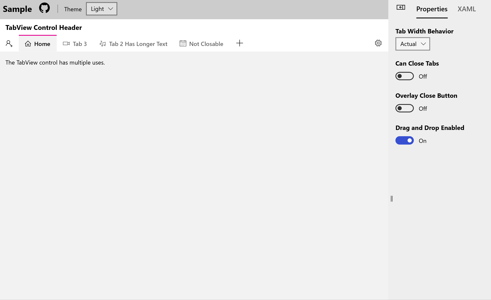

# TabView XAML Control
The [TabView](/dotnet/api/microsoft.toolkit.uwp.ui.controls.tabview) displays a set of [TabViewItem](/dotnet/api/microsoft.toolkit.uwp.ui.controls.tabviewitem) in a shared container.

> [!div class="nextstepaction"]
> [Try it in the sample app](uwpct://Controls?sample=TabView)

## Syntax

```xaml
<controls:TabView x:Name="Tabs">
  <controls:TabViewItem Header="Home">
    <TextBlock Padding="16">The TabView control has multiple uses.</TextBlock>
  </controls:TabViewItem>
  <controls:TabViewItem Header="Tab 2">
    <TextBlock Padding="16">A 2nd Tab.</TextBlock>
  </controls:TabViewItem>
</controls:TabView>
```

## Sample Output

 

## Properties

### TabView Properties

| Property | Type | Description |
| -- | -- | -- |
| CanCloseTabs | bool | Default value for if the TabViewItem doesn't specify a IsClosable value. |
| IsCloseButtonOverlay | bool | Changes the behavior of how the Close button effects layout.  If True, the close button will overlay itself on top of content if the tab is a fixed size. |
| ItemHeaderTemplate | DataTemplate | Default Template for the TabViewItem Header if no template is specified. |
| SelectedTabWidth | double | Size to set the Selected Tab Header.  Defaults to Auto. |
| TabActionHeader | object | Area to the Right of Tab Strip before Padding. |
| TabActionHeaderTemplate | DataTemplate | Template for the TabActionHeader. |
| TabEndHeader | object | Area to the Right of the Tab Strip after Padding. |
| TabEndHeaderTemplate | DataTemplate | Template for the TabEndHeader. |
| TabStartHeader | object | Description Area to the Left of the Tab Strip. |
| TabStartHeaderTemplate | DataTemplate | Template for the TabStartHeader. |
| TabWidthBehavior | TabWidthMode | Actual, Equal, or Compact values specify how Tab Headers should be sized.  Defaults to Actual. |

> [!IMPORTANT]
> Do not use `ItemsStackPanel` if you override the ItemsPanel.  It is suggested to keep the `TabWidthBehavior` to `Actual` when using a custom panel.

### TabViewItem Properties

| Property | Type | Description |
| -- | -- | -- |
| Content | object | Main Tab Content. |
| Header | object | Header Content of the Tab. |
| HeaderTemplate | DataTemplate | Template for the Header object. |
| Icon | IconElement | Icon of the Tab. |
| IsClosable | bool | Set to true for the TabViewItem to show a close button. |

## Events

### TabView Events

| Events | Description |
| -- | -- |
| TabClosing | Fires when a Tab is about to be closed, can be intercepted to prevent closure. |
| TabDraggedOutside | Fires when a Tab is dragged outside of the Tab bar. |

### TabViewItem Events
| Events | Description |
| -- | -- |
| TabClosing | Fires when a Tab's closed button is clicked. |

## Examples

If you want to replicate the behavior of Microsoft Edge with the TabView, you can use the following setup:

```xaml
<controls:TabView TabWidthBehavior="Equal"
                  CanCloseTabs="True"
                  IsCloseButtonOverlay="True"
                  CanDragItems="True"
                  CanReorderItems="True"
                  AllowDrop="True">
  <controls:TabView.Resources>
    <x:Double x:Key="TabViewItemHeaderMinHeight">32</x:Double>
    <x:Double x:Key="TabViewItemHeaderMinWidth">90</x:Double>
    <x:Double x:Key="TabViewItemHeaderMaxWidth">200</x:Double>
  </controls:TabView.Resources>
  ...
</controls:TabView>
```

The TabView supports data binding as well.  The following example shows binding the TabView to a collection of 'DataItems' which have both 'Value' and 'MyText' properties:

```xaml
<controls:TabView x:Name="TabItems"
                  ItemsSource="{Binding TabItemCollection}">
  <controls:TabView.ItemHeaderTemplate>
    <DataTemplate>
      <TextBlock>
        <Run Text="{Binding Value}"/>
        <Run Text=": "/>
        <Run Text="{Binding MyText}"/>
      </TextBlock>
    </DataTemplate>
  </controls:TabView.ItemHeaderTemplate>
  <controls:TabView.ItemTemplate>
    <DataTemplate>
      <StackPanel>
        <TextBlock Margin="8">
          <Run Text="Tab Value: "/>
          <Run Text="{Binding Value}" />
        </TextBlock>
        <TextBlock Margin="8,0,0,0" Text="Some other shared content..." />
      </StackPanel>
    </DataTemplate>
  </controls:TabView.ItemTemplate>
</controls:TabView>
```

> [!NOTE]
> It's recommended to use an [ObservableCollection](/dotnet/api/system.collections.objectmodel.observablecollection-1) when working with the TabView.

## Sample Project

[TabView Sample Page Source](https://github.com/windows-toolkit/WindowsCommunityToolkit/tree/master/Microsoft.Toolkit.Uwp.SampleApp/SamplePages/TabView). You can [see this in action](uwpct://Controls?sample=TabView) in the [Windows Community Toolkit Sample App](http://aka.ms/uwptoolkitapp).

## Default Template

[TabView XAML File](https://github.com/windows-toolkit/WindowsCommunityToolkit/blob/master/Microsoft.Toolkit.Uwp.UI.Controls/TabView/TabView.xaml) is the XAML template used in the toolkit for the default styling.

## Requirements

| Device family | Universal, 10.0.16299.0 or higher  |
| -- | -- |
| Namespace | Microsoft.Toolkit.Uwp.UI.Controls |
| NuGet package | [Microsoft.Toolkit.Uwp.UI.Controls](https://www.nuget.org/packages/Microsoft.Toolkit.Uwp.UI.Controls/) |

## API

- [TabView source code](https://github.com/Microsoft/WindowsCommunityToolkit//tree/master/Microsoft.Toolkit.Uwp.UI.Controls/TabView)

## Related Topics

- [ObservableCollection](/dotnet/api/system.collections.objectmodel.observablecollection-1)
- [IconElement](/uwp/api/Windows.UI.Xaml.Controls.IconElement)
- [TabControl (WPF)](/dotnet/api/system.windows.controls.tabcontrol)