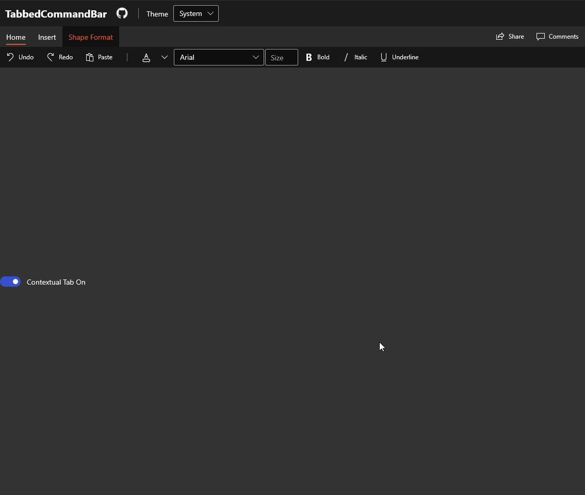

# TabbedCommandBar XAML Control
The [TabbedCommandBar](/dotnet/api/microsoft.toolkit.uwp.ui.controls.tabbedcommandbar) displays a set of [TabbedCommandBarItem](/dotnet/api/microsoft.toolkit.uwp.ui.controls.tabbedcommandbaritem) in a shared container found in many productivity type apps. It is based off of [NavigationView](/windows/uwp/design/controls-and-patterns/navigationview).

> [!div class="nextstepaction"]
> [Try it in the sample app](uwpct://Controls?sample=TabbedCommandBar)

## Remarks
The TabbedCommandBar automatically applies styles to known common controls inside an `AppBarElementContainer`. The following elements have styles:
- ComboBox
- SplitButton

> [!NOTE]
> The ComboBox does not allow changing its selection while it is in the overflow flyout.

## Syntax

```xaml
<controls:TabbedCommandBar>
  <controls:TabbedCommandBar.PaneFooter>
    <CommandBar Background="Transparent" DefaultLabelPosition="Right">
      <AppBarButton Label="Share" Icon="Share"/>
      <AppBarButton Label="Comments" Icon="Message"/>
    </CommandBar>
  </controls:TabbedCommandBar.PaneFooter>
  <controls:TabbedCommandBar.MenuItems>
    <controls:TabbedCommandBarItem Header="Home">
      <AppBarButton Icon="Undo" Label="Undo"/>
      <AppBarButton Icon="Redo" Label="Redo"/>
      <AppBarButton Icon="Paste" Label="Paste"/>
      <AppBarSeparator />
      <AppBarElementContainer>
        <SplitButton>
          <FontIcon FontFamily="{ThemeResource SymbolThemeFontFamily}" Glyph="&#xE790;" />
          <SplitButton.Flyout>
            <Flyout>
              <controls:ColorPicker Margin="-10" Color="{ThemeResource Brand-Color}"/>
            </Flyout>
          </SplitButton.Flyout>
        </SplitButton>
      </AppBarElementContainer>
      <AppBarElementContainer>
        <ComboBox SelectedIndex="0" MinWidth="175">
          <ComboBoxItem Content="Arial" />
          <ComboBoxItem Content="Calibri" />
          <ComboBoxItem Content="JetBrains Mono" />
          <ComboBoxItem Content="Roboto" />
          <ComboBoxItem Content="Sergio UI" />
          <ComboBoxItem Content="Sergio UI Semibold" />
        </ComboBox>
      </AppBarElementContainer>
      <AppBarElementContainer>
        <TextBox PlaceholderText="Size"/>
      </AppBarElementContainer>
      <AppBarToggleButton Icon="Bold" Label="Bold" />
      <AppBarToggleButton Icon="Italic" Label="Italic" />
      <AppBarToggleButton Icon="Underline" Label="Underline" />
    </controls:TabbedCommandBarItem>
    <controls:TabbedCommandBarItem Header="Insert">
      <AppBarButton Icon="Pictures" Label="Pictures">
        <AppBarButton.Flyout>
          <MenuFlyout Placement="BottomEdgeAlignedLeft">
            <MenuFlyoutItem Text="This Device">
              <MenuFlyoutItem.Icon>
                <FontIcon FontFamily="Segoe MDL2 Assets" Glyph="&#xEC4E;" />
              </MenuFlyoutItem.Icon>
            </MenuFlyoutItem>
            <MenuFlyoutItem Text="Stock Images">
              <MenuFlyoutItem.Icon>
                <FontIcon FontFamily="Segoe MDL2 Assets" Glyph="&#xE721;" />
              </MenuFlyoutItem.Icon>
            </MenuFlyoutItem>
            <MenuFlyoutItem Icon="Globe" Text="Online Pictures" />
          </MenuFlyout>
        </AppBarButton.Flyout>
      </AppBarButton>
      <AppBarButton Label="Shapes">
        <AppBarButton.Icon>
          <FontIcon FontFamily="Segoe UI Symbol" Glyph="&#x25A1;" />
        </AppBarButton.Icon>
      </AppBarButton>
      <AppBarButton Label="Icons">
        <AppBarButton.Icon>
          <FontIcon FontFamily="Segoe MDL2 Assets" Glyph="&#xED58;" />
        </AppBarButton.Icon>
      </AppBarButton>
      <AppBarButton Label="3D Models">
        <AppBarButton.Icon>
          <FontIcon FontFamily="Segoe MDL2 Assets" Glyph="&#xF158;" />
        </AppBarButton.Icon>
      </AppBarButton>
      <AppBarSeparator/>
      <AppBarButton Label="Add-ins">
        <AppBarButton.Icon>
          <FontIcon FontFamily="Segoe MDL2 Assets" Glyph="&#xECAA;" />
        </AppBarButton.Icon>
      </AppBarButton>
      <controls:TabbedCommandBarItem.SecondaryCommands>
        <AppBarButton Icon="Add" Label="New item" />
      </controls:TabbedCommandBarItem.SecondaryCommands>
    </controls:TabbedCommandBarItem>
    <controls:TabbedCommandBarItem Header="Shape Format" IsContextual="True" Visibility="{Binding ElementName=ContextualToggle, Path=IsOn}">
      <AppBarButton Label="Shape Fill">
        <AppBarButton.Icon>
          <FontIcon FontFamily="{ThemeResource SymbolThemeFontFamily}" Glyph="&#xE771;" />
        </AppBarButton.Icon>
      </AppBarButton>
      <AppBarButton Label="Shape Outline">
        <AppBarButton.Icon>
          <FontIcon FontFamily="{ThemeResource SymbolThemeFontFamily}" Glyph="&#xE76D;" />
        </AppBarButton.Icon>
      </AppBarButton>
    </controls:TabbedCommandBarItem>
  </controls:TabbedCommandBar.MenuItems>
</controls:TabbedCommandBar>
```

## Sample Output

 

## Properties

### TabbedCommandBar Properties

The TabbedCommandBar does not add any of its own properties. See [NavigationView](https://docs.microsoft.com/uwp/api/windows.ui.xaml.controls.navigationview#properties) for a list of accessible properties.

> [!IMPORTANT]
> Do not use `ItemsStackPanel` if you override the ItemsPanel.  It is suggested to keep the `TabWidthBehavior` to `Actual` when using a custom panel.

### TabbedCommandBarItem Properties

| Property | Type | Description |
| -- | -- | -- |
| Header | object | Header Content of the Tab. |
| IsContextual | bool | Set to true for the TabbedCommandBarItem to be styled as a contextual Tab. |
| OverflowButtonAlignment | HorizontalAlignment | Indicates the alignment of the command overflow button. |
| CommandAlignment | HorizontalAlignment | Indicates the alignment of this Tab's commands. |

## Events

### TabbedCommandBar Events

| Events | Description |
| -- | -- |
| SelectionChanged | Fires when a different Tab is selected. |

## Examples

The following setup demos contextual tabs, and binding to their visibility:

```xaml
<controls:TabbedCommandBar>
  <controls:TabbedCommandBar.MenuItems>
    <controls:TabbedCommandBarItem Header="Home">
      <AppBarButton Icon="Undo" Label="Undo"/>
      <AppBarButton Icon="Redo" Label="Redo"/>
      <AppBarButton Icon="Paste" Label="Paste"/>
    </controls:TabbedCommandBarItem>
    <controls:TabbedCommandBarItem Header="View" IsContextual="True" Visibility="{Binding ElementName=ContextualToggle, Path=IsOn}">
      <AppBarButton Label="Left" Icon="DockLeft"/>
      <AppBarButton Label="Right" Icon="DockRight"/>
      <AppBarButton Label="Bottom" Icon="DockBottom"/>
    </controls:TabbedCommandBarItem>
  </controls:TabbedCommandBar.MenuItems>
</controls:TabbedCommandBar>

...

<ToggleSwitch x:Name="ContextualToggle" IsOn="True"
              OffContent="Contextual Tab Off"
              OnContent="Contextual Tab On"/>
```

`ComboBox`, `TextBox`, and `SplitButton` do not have "AppBar" variants. Below is how to use those controls in a `TabbedCommandBarItem`:

```xaml
<controls:TabbedCommandBar>
  <controls:TabbedCommandBar.MenuItems>
    <controls:TabbedCommandBarItem Header="Home">

      <!-- SplitButton -->
      <AppBarElementContainer>
        <SplitButton>
          <FontIcon Glyph="&#xE186;" FontSize="18" />
          <SplitButton.Flyout>
            <Flyout>
              <controls:ColorPicker Margin="-10" Color="{ThemeResource Brand-Color}"/>
            </Flyout>
          </SplitButton.Flyout>
        </SplitButton>
      </AppBarElementContainer>

      <!-- ComboBox -->
      <AppBarElementContainer>
        <ComboBox SelectedIndex="0" MinWidth="175">
          <ComboBoxItem Content="Arial" />
          <ComboBoxItem Content="Calibri" />
          <ComboBoxItem Content="JetBrains Mono" />
          <ComboBoxItem Content="Roboto" />
          <ComboBoxItem Content="Sergio UI" />
          <ComboBoxItem Content="Sergio UI Semibold" />
        </ComboBox>
      </AppBarElementContainer>

      <!-- TextBox -->
      <AppBarElementContainer>
        <TextBox PlaceholderText="Size"/>
      </AppBarElementContainer>
      
    </controls:TabbedCommandBarItem>
  </controls:TabbedCommandBar.MenuItems>
</controls:TabbedCommandBar>
```

## Sample Project

[TabbedCommandBar Sample Page Source](https://github.com/windows-toolkit/WindowsCommunityToolkit/tree/master/Microsoft.Toolkit.Uwp.SampleApp/SamplePages/TabbedCommandBar). You can [see this in action](uwpct://Controls?sample=TabbedCommandBar) in the [Windows Community Toolkit Sample App](http://aka.ms/uwptoolkitapp).

## Default Template

[TabbedCommandBar XAML File](https://github.com/windows-toolkit/WindowsCommunityToolkit/blob/master/Microsoft.Toolkit.Uwp.UI.Controls/TabbedCommandBar/TabbedCommandBar.xaml) is the XAML template used in the toolkit for the default styling.

## Requirements

| Device family | Universal, 10.0.17763.0 or higher  |
| -- | -- |
| Namespace | Microsoft.Toolkit.Uwp.UI.Controls |
| NuGet package | [Microsoft.Toolkit.Uwp.UI.Controls](https://www.nuget.org/packages/Microsoft.Toolkit.Uwp.UI.Controls/) |

## API

- [TabbedCommandBar source code](https://github.com/Microsoft/WindowsCommunityToolkit/tree/master/Microsoft.Toolkit.Uwp.UI.Controls.Core/TabbedCommandBar)

## Related Topics

- [ObservableCollection](https://docs.microsoft.com/dotnet/api/system.collections.objectmodel.observablecollection-1)
- [NavigationView](https://docs.microsoft.com/uwp/api/Windows.UI.Xaml.Controls.NavigationView)
- [AppBarElementContainer](https://docs.microsoft.com/uwp/api/Windows.UI.Xaml.Controls.AppBarElementContainer)
- [Ribbon (WPF)](https://docs.microsoft.com/dotnet/api/system.windows.controls.ribbon.ribbon)
