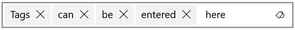

# TokenizingTextBox XAML Control

The [TokenizingTextBox](https://docs.microsoft.com/dotnet/api/microsoft.toolkit.uwp.ui.controls.tokenizingtextbox) is an advanced [AutoSuggestBox](https://docs.microsoft.com/en-us/uwp/api/Windows.UI.Xaml.Controls.AutoSuggestBox) which will display selected items as tokens within the textbox. A user can easily see the picked items or remove them easily.

> [!div class="nextstepaction"]
> [Try it in the sample app](uwpct://Controls?sample=TokenizingTextBox)

## Syntax

```xaml
  <controls:TokenizingTextBox
    QueryIcon="Tag"
    PlaceholderText="Add Tags"
    TokenDelimiter=","/>
```

## Sample Output

  

## Properties

| Property | Type | Description |
| -- | -- | -- |
| AutoSuggestBoxStyle | Style | Inner AutoSuggestBox style |
| AutoSuggestBoxTextBoxStyle | Style | Inner TextBox style of the AutoSuggestBox |
| QueryText | string | Gets or sets the text query of the AutoSuggestBox |
| SelectedItems | IList<object> | Collection of items selected by the user |
| SuggestedItemsSource | object | List of suggested items |
| SuggestedItemTemplate | DataTemplate | Template for suggested items |
| SuggestedItemTemplateSelector | DataTemplateSelector | Template selector for suggested items |
| SuggestedItemContainerStyle | Style for suggested item's container |
| TokenDelimiter | string | Character delimiter for recognizing a token |
| TokenItemTemplate | DataTemplate | Template for a token item |
| TokenItemTemplateSelector | DataTemplateSelector | Template selector for token items |
| TokenItemStyle | Style | Style for a token item |
| TokenizedItems | IList<object> | Collection of items picked by the user |
| TokenSpacing | double | Amount of spacing between tokens |

## Methods

| Methods | Return Type | Description |
| -- | -- | -- |
| GetUntokenizedText(string) | string | Returns the string representation of each token item, concatenated and delimited. |

## Events

| Events | Description |
| -- | -- |
| QuerySubmitted | Event raised when the user submits the text query. |
| SuggestionChosen | Event raised when a suggested item is chosen by the user. |
| TextChanged | Event raised when the text input value has changed. |
| TokenItemAdded | Event raised when a new token item has been added. |
| TokenItemClicked | Event raised when a token item has been clicked. |
| TokenItemRemoved | Event raised when a token item has been removed. |

## Sample Project

[TokenizingTextBox sample page Source](https://github.com/windows-toolkit/WindowsCommunityToolkit/tree/master/Microsoft.Toolkit.Uwp.SampleApp/SamplePages/TokenizingTextBox). You can [see this in action](uwpct://Controls?sample=TokenizingTextBox) in [Windows Community Toolkit Sample App](http://aka.ms/uwptoolkitapp).

## Requirements

| Device family | Universal, 10.0.16299.0 or higher |
| -- | -- |
| Namespace | Microsoft.Toolkit.Uwp.UI.Controls |
| NuGet package | [Microsoft.Toolkit.Uwp.UI.Controls](https://www.nuget.org/packages/Microsoft.Toolkit.Uwp.UI.Controls/) |

## API

* [TokenizingTextBox source code](https://github.com/windows-toolkit/WindowsCommunityToolkit/tree/master/Microsoft.Toolkit.Uwp.UI.Controls/TokenizingTextBox)

## Related Topics

* [AutoSuggestBox](https://docs.microsoft.com/en-us/uwp/api/Windows.UI.Xaml.Controls.AutoSuggestBox)
