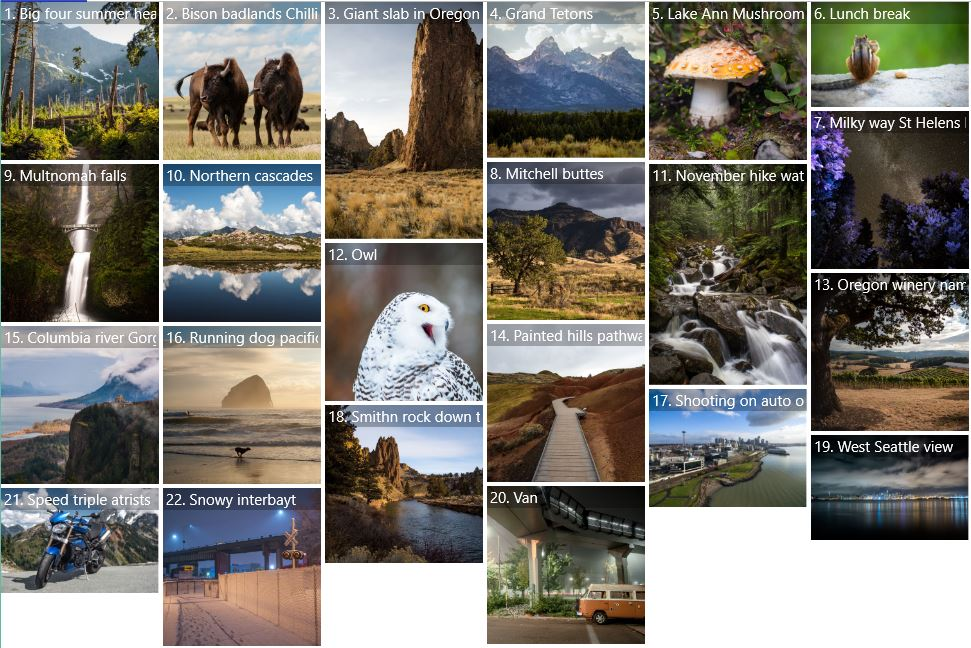

# StaggeredLayout

The [StaggeredLayout](https://docs.microsoft.com/en-us/dotnet/api/microsoft.toolkit.uwp.ui.controls.StaggeredLayout) virtualizes layout of items in a column approach where an item will be added to whichever column has used the least amount of space.

> [!div class="nextstepaction"]
> [Try it in the sample app](uwpct://Controls?sample=StaggeredLayout)

## Syntax

**XAML**

```xaml
<winui:ItemsRepeater>
    <winui:ItemsRepeater.Layout>
        <controls:StaggeredLayout />
    </winui:ItemsRepeater.Layout>
    <winui:ItemsRepeater.ItemTemplate>
        <DataTemplate>
            <Image Source="{Binding Thumbnail}"/>
        </DataTemplate>
    </winui:ItemsRepeater.ItemTemplate>
</winui:ItemsRepeater>

```

## Sample Output



## Properties

| Property | Type | Description |
| -- | -- | -- |
| DesiredColumnWidth | double | The desired width of each column. The width of columns can exceed the DesiredColumnWidth if the HorizontalAlignment is set to Stretch. |
| ColumnSpacing | double  | Gets or sets the distance between columns |
| RowSpacing | double  | Gets or sets the vertical distance between items |

## Sample Project

[StaggeredLayout Sample Page](https://github.com/Microsoft/WindowsCommunityToolkit//tree/master/Microsoft.Toolkit.Uwp.SampleApp/SamplePages/StaggeredLayout). You can [see this in action](uwpct://Controls?sample=StaggeredLayout) in the [Windows Community Toolkit Sample App](https://aka.ms/uwptoolkitapp).

## Requirements

| [Device family](http://go.microsoft.com/fwlink/p/?LinkID=526370#device-families) | Universal, 10.0.17134.0 or higher   |
| -- | -- |
| Namespace | Microsoft.Toolkit.Uwp.UI.Controls |
| NuGet package | [Microsoft.Toolkit.Uwp.UI.Controls.Layout](https://www.nuget.org/packages/Microsoft.Toolkit.Uwp.UI.Controls.Layout/) |

## API

- [StaggeredLayout](https://github.com/Microsoft/WindowsCommunityToolkit//tree/master/Microsoft.Toolkit.Uwp.UI.Controls.Layout/StaggeredLayout)