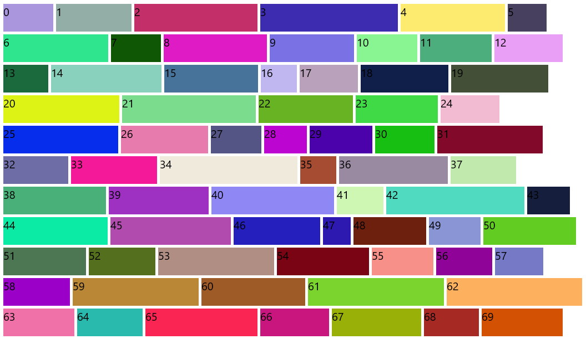

# WrapLayout XAML Layout Panel

The [WrapLayout](https://docs.microsoft.com/dotnet/api/microsoft.toolkit.uwp.ui.controls.WrapLayout) virtualizes layout of child elements in sequential position from left to right, breaking content to the next line at the edge of the containing box. Subsequent ordering happens sequentially from top to bottom or from right to left, depending on the value of the Orientation property.

The WrapLayout positions child controls based on orientation, horizontal orientation (default) positions controls from left to right and vertical orientation positions controls from top to bottom, and once the max-width or height is reached the control automatically creates rows or columns based on the orientation. 

Spacing can be automatically added between items using the HorizontalSpacing and VerticalSpacing properties. When the Orientation is Horizontal, HorizontalSpacing adds uniform horizontal spacing between each individual item, and VerticalSpacing adds uniform spacing between each row of items.

When the Orientation is Vertical, HorizontalSpacing adds uniform spacing between each column of items, and VerticalSpacing adds uniform vertical spacing between individual items.

> [!div class="nextstepaction"]
> [Try it in the sample app](uwpct://Controls?sample=WrapLayout)

## Syntax

```xaml
<winui:ItemsRepeater ItemsSource="{x:Bind _items}">
    <winui:ItemsRepeater.Layout>
        <controls:WrapLayout VerticalSpacing="10" HorizontalSpacing="10"/>
    </winui:ItemsRepeater.Layout>
</winui:ItemsRepeater>
```

## Sample Output



## Properties

| Property | Type | Description |
| -- | -- | -- |
| Orientation | Orientation | Gets or sets the orientation of the WrapLayout, Horizontal or vertical means that child controls will be added horizontally until the width of the panel can't fit more control, then a new row is added to fit new horizontal added child controls, vertical means that child will be added vertically until the height of the panel is received then a new column is added |
| VerticalSpacing | double  | Gets or sets the vertical distance between items |
| HorizontalSpacing | double  | Gets or sets the horizontal distance between items |

## Examples

The following example of adding the WrapLayout layout panel.

```xaml
<Page ....
      xmlns:controls="using:Microsoft.Toolkit.Uwp.UI.Controls"
      xmlns:winui="using:Microsoft.UI.Xaml.Controls">

    <Grid Background="{StaticResource Brush-Grey-05}">
        <Grid.RowDefinitions>
            <RowDefinition />
            <RowDefinition />
        </Grid.RowDefinitions>
        <Grid>
            <Grid.RowDefinitions>
                <RowDefinition Height="50" />
                <RowDefinition />
            </Grid.RowDefinitions>
            <Button Name="HorizontalButton" Click="HorizontalButton_Click" Content="Add Horizontal Control" />
            <winui:ItemsRepeater ItemsSource="{x:Bind _horizontalItems}" Grid.Row="1" Margin="2">
                <winui:ItemsRepeater.Layout>
                    <controls:WrapLayout VerticalSpacing="10"
                                         HorizontalSpacing="10"/>
                </winui:ItemsRepeater.Layout>
            </winui:ItemsRepeater>
        </Grid>

        <Grid Grid.Row="1">
            <Grid.RowDefinitions>
                <RowDefinition Height="50" />
                <RowDefinition />
            </Grid.RowDefinitions>
            <Button Name="VerticalButton" Click="VerticalButton_Click" Content="Add Vertical Control" />
            <winui:ItemsRepeater ItemsSource="{x:Bind _verticalItems}" Grid.Row="1" Margin="2">
                <winui:ItemsRepeater.Layout>
                    <controls:WrapLayout Orientation="Vertical" 
                                         VerticalSpacing="10"
                                         HorizontalSpacing="10"/>
                </winui:ItemsRepeater.Layout>
            </winui:ItemsRepeater>
        </Grid>
    </Grid>
</Page>
```

## Sample Project

[WrapLayout Sample Page Source](https://github.com/Microsoft/WindowsCommunityToolkit//tree/master/Microsoft.Toolkit.Uwp.SampleApp/SamplePages/WrapLayout). You can [see this in action](uwpct://Controls?sample=WrapLayout) in the [Windows Community Toolkit Sample App](http://aka.ms/uwptoolkitapp).

## Requirements

| [Device family](http://go.microsoft.com/fwlink/p/?LinkID=526370#device-families) | Universal, 10.0.17134.0 or higher   |
| -- | -- |
| Namespace | Microsoft.Toolkit.Uwp.UI.Controls |
| NuGet package | [Microsoft.Toolkit.Uwp.UI.Controls.Layout](https://www.nuget.org/packages/Microsoft.Toolkit.Uwp.UI.Controls.Layout/) |

## API

* [WrapLayout source code](https://github.com/Microsoft/WindowsCommunityToolkit//tree/master/Microsoft.Toolkit.Uwp.UI.Controls.Layout/WrapLayout)
