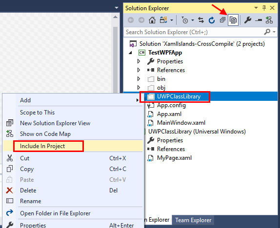

# WindowsXamlHost Control for Windows Forms and WPF

> [!NOTE]
> This control is currently available as a developer preview. Although we encourage you to try out this control in your own prototype code now, we do not recommend that you use it in production code at this time. This control will continue to mature and stabilize in future toolkit releases. [Known Issues](../../knownissues.md)

By using the **WindowsXamlHost** control, you can add built-in or custom UWP controls to the User Interface (UI) of your WPF or Windows Forms desktop application. For background information about this developer scenario, see [UWP controls in desktop applications](https://docs.microsoft.com/windows/uwp/xaml-platform/xaml-host-controls).

## Get started

To get the **WindowsXamlHost** control, install the appropriate Nuget package:
* For WPF applications, install the [Microsoft.Toolkit.Wpf.XamlHost](https://www.nuget.org/packages/Microsoft.Toolkit.Wpf.UI.XamlHost) package.
* For Windows Forms applications, install the [Microsoft.Toolkit.Forms.UI.XamlHost](https://www.nuget.org/packages/Microsoft.Toolkit.Forms.UI.XamlHost) package.

After you install the NuGet package, [set up your project](https://docs.microsoft.com/windows/uwp/porting/desktop-to-uwp-enhance#first-set-up-your-project) so that it can use UWP types.

### Add a Windows XAML host control

In the Visual Studio **Toolbox** window, find the **WindowsXamlHost** control, and then drag it onto the designer of your WPF or Windows Forms application.

You'll find the **WindowsXamlHost** control in the **Windows Community Toolkit** section of the Visual Studio **Toolbox**.

### Specify a UWP control type

In the **Properties** window, set the **InitialTypeName** property to the fully qualified name of the UWP control that you want associate with the **WindowsXamlHost** control.

You'll find the **InitialTypeName** property in the **XAML** section of the **Properties** window.

**WPF**


**Windows Forms**


### Initialize the UWP control

In the **Properties** window, double-click the **ChildChanged** field to generate an event handler.

**WPF**


**Windows Forms**


Initialize your UWP control by adding code to this handler. Your code can set properties and handle the events of the UWP control. Here's a basic example that sets a property and handles an event of a UWP **Button** class.

```csharp

private void MyWindowsXAMLHost_ChildChanged(object sender, EventArgs e)
{
    WindowsXamlHost windowsXamlHost = (WindowsXamlHost)sender;

    Windows.UI.Xaml.Controls.Button button =
        (Windows.UI.Xaml.Controls.Button)windowsXamlHost.Child;

    button.Content = "My UWP button";
    button.Click += Button_Click;
}

private void Button_Click(object sender, Windows.UI.Xaml.RoutedEventArgs e)
{
    MessageBox.Show("My UWP button works");
}
```
If you don't want to initialize UWP controls in the **ChildChanged** event, you can create instances of UWP controls by using the **CreateXamlContentByType** convenience method. Before you show that control in the UI of your application, you'll have to associate it with a Windows XAML host control.

Here's an example.

```csharp
private void UseHelperMethod()
{
    WindowsXamlHost myHostControl = new WindowsXamlHost();

    // Use helper method to create a UWP control instance.
    Windows.UI.Xaml.Controls.Button myButton =
        UWPTypeFactory.CreateXamlContentByType("Windows.UI.Xaml.Controls.Button")
        as Windows.UI.Xaml.Controls.Button;

    // Initialize UWP control.
    myButton.Name = "button1";
    myButton.Width = 75;
    myButton.Height = 40;
    myButton.TabIndex = 0;
    myButton.Content = "button1";
    myButton.Click += MyButton_Click;

    // initialize the Windows XAML host control.
    myHostControl.Name = "myWindowsXamlHostControl";

    // Associate the Windows XAML host control with the UWP control.
    // For Windows Forms applications, you might use this.Controls.Add(myHostControl);
    myHostControl.Child = myButton;

    // Make the UWP control appear in the UI.
    this.MyStackPanel.Children.Add(myHostControl);
}

private void MyButton_Click(object sender, Windows.UI.Xaml.RoutedEventArgs e)
{
    MessageBox.Show("My Button Worked");
}
```

## Initialize UWP controls first, and then assign them to Windows XAML host controls

In some situations, you might want to create instances of UWP controls without having to first create Windows XAML host controls.

If you choose to do this, make sure to first call the **InitializeForCurrentThread** method of the **WindowsXamlManager** class. This initializes the UWP hosting environment so that you can create and initialize UWP controls.

You can create a Windows XAML host control when you are ready to show any of those UWP controls in a UI. This example initializes the UWP hosting environment, creates a UWP button and then creates a Windows XAML host control only for the purpose of showing the UWP control in the UI.

```csharp
private void CreateUWPControlsFirst()
{
    // Initialize the UWP hosting environment.
    global::Windows.UI.Xaml.Hosting.WindowsXamlManager.InitializeForCurrentThread();

    // Create a UWP control.
    Windows.UI.Xaml.Controls.Button myButton = new Windows.UI.Xaml.Controls.Button();

    // Initialize UWP control.
    myButton.Name = "button1";
    myButton.Width = 75;
    myButton.Height = 40;
    myButton.TabIndex = 0;
    myButton.Content = "button1";
    myButton.Click += MyButton_Click;

    // Create a Windows XAML host control.
    WindowsXamlHost myHostControl = new WindowsXamlHost();

    // initialize the Windows XAML host control.
    myHostControl.Name = "myWindowsXamlHostControl";

    // Associate the Windows XAML host control with the UWP control.
    myHostControl.Child = myButton;

    // Make the UWP control appear in the UI.
    // For Windows Forms applications, you might use this.Controls.Add(myHostControl);
    this.MyStackPanel.Children.Add(myHostControl);
}

private void MyButton_Click(object sender, Windows.UI.Xaml.RoutedEventArgs e)
{
    MessageBox.Show("My Button Worked");
}
```

## Add a custom UWP control

You can add a custom control that contains one or more UWP controls and custom functionality. To do this, you'll configure two projects: A UWP class library project, and the WPF or Windows Forms application project.

The following instructions uses a WPF project.

### Configure a UWP class library project

First, add a **Class Library (Universal Windows)** project to your solution.


In **Solution Explorer**, right-click the class library project, and then choose **Unload Project**. Then, right-click that project, and choose **Edit <Your project name>** to open it in the Visual Studio code editor.


Add these properties to the project file anywhere **before** the import for Microsoft.Windows.UI.Xaml.CSharp.targets file as shown below. If they don't come before, you may see errors compiling XamlTypeInfo.g.cs in your host project.

```xml
<PropertyGroup>
  <EnableTypeInfoReflection>false</EnableTypeInfoReflection>
  <EnableXBindDiagnostics>false</EnableXBindDiagnostics>
</PropertyGroup>
<Import Project="$(MSBuildExtensionsPath)\Microsoft\WindowsXaml\v$(VisualStudioVersion)\Microsoft.Windows.UI.Xaml.CSharp.targets" />
```

Add these post-build steps **after** the import for Microsoft.Windows.UI.Xaml.CSharp.targets file as shown below.  If they don't come after, the project variables, ie: $(TargetDir), $(ProjectDir), and $(ProjectName) will not be defined resulting in copy errors and the post-build event failing.

```xml
  <Import Project="$(MSBuildExtensionsPath)\Microsoft\WindowsXaml\v$(VisualStudioVersion)\Microsoft.Windows.UI.Xaml.CSharp.targets" />  
  <PropertyGroup>
    <HostFrameworkProject>TestWPFApp</HostFrameworkProject>
    <ObjPath>obj\$(Platform)\$(Configuration)\</ObjPath>
  </PropertyGroup>
  <PropertyGroup Condition=" '$(Platform)' == 'AnyCPU' ">
    <ObjPath>obj\$(Configuration)\</ObjPath>
  </PropertyGroup>
  <PropertyGroup>
    <!-- Copy source and build output files to hostapp folders -->
    <!-- Default Winforms/WPF projects do not use $Platform for build output folder -->
    <PostBuildEvent>
      md $(SolutionDir)$(HostFrameworkProject)\$(ProjectName)
      md $(SolutionDir)$(HostFrameworkProject)\bin\$(Configuration)\$(ProjectName)
      copy $(TargetDir)*.xbf            $(SolutionDir)$(HostFrameworkProject)\bin\$(Configuration)\$(ProjectName)
      copy $(ProjectDir)*.xaml          $(SolutionDir)$(HostFrameworkProject)\bin\$(Configuration)\$(ProjectName)
      copy $(ProjectDir)*.xaml.cs       $(SolutionDir)$(HostFrameworkProject)\$(ProjectName)
      copy $(ProjectDir)$(ObjPath)*.g.* $(SolutionDir)$(HostFrameworkProject)\$(ProjectName)
    </PostBuildEvent>
  </PropertyGroup>
```
>[!NOTE]
>Make sure to set the value of the ``<HostFrameworkProject>`` element to the name of your WPF project

Right-click the library project, and then choose **Reload Project**.

Build the UWP class library project.

### Include UWP Xaml artifacts in the WPF application project
Now we need to add the Xaml artifacts that were built by the UWP Class library and published into the WPF project via the post-Build events.  To do this click on the WPF project and choose the **Show All Files** icon in the solution explorer.  This will show the UWPClassLibrary folder that was created.  Then right-click on the folder and choose **Include in Project**.



After including, you can turn off Show All Files.

Build your WPF application.

To keep the WPF application in sync with future changes to the UWP Class Library, you need to explicitly add a build dependency by right-clicking on the WPF project, and choosing "Build Dependencies".  Add a Project dependency so the WPF application depends on the UWP Class Library.

## Bind data from your desktop application to a field in the custom control

In **Solution Explorer**, expand the UWP class library project, and open the code behind file of a page.


Add a field to that page. This example adds a field named ``WPFMessage`` in a WPF application.

```csharp
public sealed partial class MyPage : Page
{
    // Some backing class for x:Bindings
    public string WPFMessage { get; set; }
    public MyPage()
    {
        this.InitializeComponent();
    }
}
```

Open the XAML for that page in the designer, add a control, and bind an attribute of that control to the field that you just defined.

This example adds a ``TextBlock`` control to a ``StackPanel``, and then binds the ``Text`` attribute of that control to the ``WPFMessage`` field.

```xml
<StackPanel Background="LightCoral">
    <TextBlock>This is a simple UWP XAML page</TextBlock>
    <Rectangle Fill="Blue" Height="100" Width="100"/>
    <TextBlock Text="{x:Bind WPFMessage}" FontSize="50"></TextBlock>
</StackPanel>
```

In **Solution Explorer**, expand the WPF application project, and open a XAML page from that project in the designer.

In the Visual Studio **Toolbox** window, find the **WindowsXamlHost** control and then drag it onto the designer of your WPF application.

In the **Properties** window, set the **InitialTypeName** property to the fully qualified name of the class in your UWP class library project that contains the field you defined earlier.


In the **Properties** window, double-click the **ChildChanged** field to generate an event handler.

In this handler, assign the value of the ``WPFMessage`` field that is in the UWP class to the value of the field that you add to the WPF application. In this example, the name of that field is also ``WPFMessage``.

```csharp
public partial class MainWindow : Window
{

    private void MyUWPPage_ChildChanged(object sender, EventArgs e)
    {
        // Hook up x:Bind source
        global::Microsoft.Windows.Interop.WindowsXamlHost windowsXamlHost = sender as global::Microsoft.Windows.Interop.WindowsXamlHost;
        global::UWPClassLibrary.MyPage myUWPPage = windowsXamlHost.Child as global::UWPClassLibrary.MyPage;

        if (myUWPPage != null)
        {
            myUWPPage.WPFMessage = this.WPFMessage;
        }
    }
    public string WPFMessage
    {
        get
        {
            return "Binding from WPF to UWP XAML";
        }
    }
    public MainWindow()
    {
        InitializeComponent();
    }
}
```

## Requirements

|        |        |
|--------|--------|
| Device family | .NET 4.6.2, Windows 10 (introduced v10.0.17709.0) |
| Namespace | Windows Forms: Microsoft.Toolkit.Forms.UI.XamlHost <br/> WPF: Microsoft.Toolkit.Wpf.UI.XamlHost |
| NuGet package | Windows Forms: [Microsoft.Toolkit.Forms.UI.XamlHost](https://www.nuget.org/packages/Microsoft.Toolkit.Forms.UI.XamlHost)  <br/> WPF: [Microsoft.Toolkit.Wpf.UI.XamlHost](https://www.nuget.org/packages/Microsoft.Toolkit.Wpf.UI.XamlHost) |

## API Source Code

- [WindowsXamlHost (Windows Forms)](https://github.com/Microsoft/WindowsCommunityToolkit/tree/master/Microsoft.Toolkit.Win32/Microsoft.Toolkit.Forms.UI.XamlHost)
- [WindowsXamlHost (WPF)](https://github.com/Microsoft/WindowsCommunityToolkit/tree/master/Microsoft.Toolkit.Win32/Microsoft.Toolkit.Wpf.UI.XamlHost)
