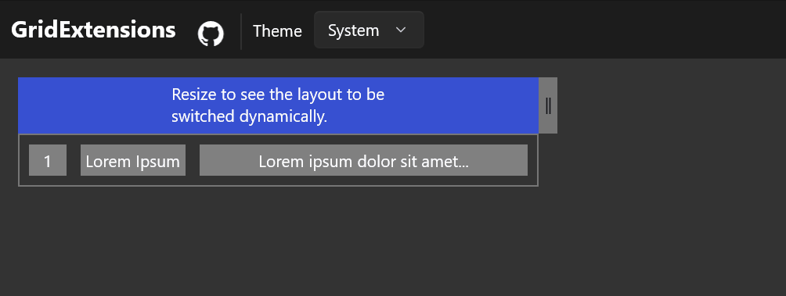

# Grid Extensions

[GridExtensions](/dotnet/api/microsoft.toolkit.uwp.ui.gridextensions) provides `ActiveLayout` and `Layouts` attached properties for [`Grid`](/uwp/api/windows.ui.xaml.grid) objects to enable dynamic layout switching capability.

> **Platform APIs:**
[`GridExtensions`](/dotnet/api/microsoft.toolkit.uwp.ui.gridextensions)


> [!div class="nextstepaction"]
> [Try it in the sample app](uwpct://Extensions?sample=GridExtensions)

## API

### `GridExtensions.Layouts: IDictionary<string, GridLayoutDefinition>`

Defines possible layouts for the `Grid` to dynamically switch among.

```xml
<Grid>
  <GridExtensions.Layouts>
    <GridLayoutDefinition x:Key="layout1">...</GridLayoutDefinition>
    <GridLayoutDefinition x:Key="awesome-layout">...</GridLayoutDefinition>
    <GridLayoutDefinition x:Key="any-string-key">...</GridLayoutDefinition>
    ...
  </GridExtensions.Layouts>
</Grid>
```

### `GridExtensions.ActiveLayout: string`

Specifies which layout in the `GridExtensions.Layouts` dictionary to apply upon the `Grid`.

```xml
<Grid GridExtensions.ActiveLayout="awesome-layout">
  <GridExtensions.Layouts>
    <GridLayoutDefinition x:Key="layout1">...</GridLayoutDefinition>
    <GridLayoutDefinition x:Key="awesome-layout">...</GridLayoutDefinition>
    <GridLayoutDefinition x:Key="any-string-key">...</GridLayoutDefinition>
  </GridExtensions.Layouts>
</Grid>
```

### `GridLayoutDefinition`

Defines a grid layout, consists of row definitions, column definitions and an area definition.

`GridLayoutDefinition.RowDefinitions` and `GridLayoutDefinition.ColumnDefinitions` follow the same pattern as those of `Grid`.

`GridLayoutDefinition.AreaDefinition` is a string that defines how to arrange child elements, i.e., it defines row index, column index, row span and column span of child elements.
Child elements have to be associated with a `x:Name` attribute and the `x:Name`s are expected to appear in the area definition following these rules:

1. `x:Name` attribute of an element represents its place in the `Grid` layout in area definition string.
2. Rows are separated with semicolon
3. Cells in same row are separated with whitespace.
4. Row/Column span of an element is expressed by repeating the `x:Name` attribute of that element.

```xml
<Grid>
  <GridLayoutDefinition>
    <GridLayoutDefinition.RowDefinitions>...</GridLayoutDefinition.RowDefinitions>
    <GridLayoutDefinition.ColumnDefinitions>...</GridLayoutDefinition.ColumnDefinitions>
    <!-- AreaDefinition is actually declared as ContentProperty of GridLayoutDefinition, -->
    <!-- so it could be written directly as a child of GridLayoutDefinition node for simplicity -->
    <GridLayoutDefinition.AreaDefinition>
      ElementA ElementB ElementC;
      ElementA ElementD ElementD;
      ElementE ElementE ElementE
    </GridLayoutDefinition.AreaDefinition>
  </GridLayoutDefinition>
  <Border x:Name="ElementA"/>
  <Border x:Name="ElementB"/>
  <Border x:Name="ElementC"/>
  <Border x:Name="ElementD"/>
  <Border x:Name="ElementE"/>
</Grid>
```
The above code describes a layout of
```
    +----------+----------+----------+
    |          | ElementB | ElementC |
    | ElementA +----------+----------+
    |          |       ElementD      |
    +----------+---------------------+
    |             ElementE           |
    +--------------------------------+
```

## Example

Say we have a `Grid` and expect it to be
```
+---+-------------+-------------------------------+
| 1 | Lorem ipsum | Lorem ipsum dolor sit amet... |
+---+-------------+-------------------------------+
```
by default and switch to following layout in narrower viewport.
```
+---+---------------------------+
| 1 |         Lorem ipsum       |
+---+---------------------------+
| Lorem ipsum dolor sit amet... |
+=------------------------------+
```
```xml
<!-- In VisualState.Setter or codebehind, changing the ActiveLayout property to "Narrow" will switch the Grid layout -->
<Grid ui:GridExtensions.ActiveLayout="Normal">
    <!-- Declaratively define the possible layouts. -->
    <!-- GridEx.Layouts is a dictionary of GridLayoutDefinition -->
    <ui:GridExtensions.Layouts>
        <ui:GridLayoutDefinition x:Key="Normal">
            <!-- A GridLayoutDefinition consists of -->
            <!-- row definitions, column definitions and an area definition -->
            <ui:GridLayoutDefinition.RowDefinitions>
                <RowDefinition Height="Auto"/>
            </ui:GridLayoutDefinition.RowDefinitions>
            <ui:GridLayoutDefinition.ColumnDefinitions>
                <ColumnDefinition Width="Auto"/>
                <ColumnDefinition Width="Auto"/>
                <ColumnDefinition Width="*"/>
            </ui:GridLayoutDefinition.ColumnDefinitions>
            <!-- Area definition just simply puts down -->
            <!-- children names in desired order -->
            Number Title Description
        </ui:GridLayoutDefinition>
        <ui:GridLayoutDefinition x:Key="Narrow">
            <ui:GridLayoutDefinition.RowDefinitions>
                <RowDefinition Height="Auto"/>
                <RowDefinition Height="Auto"/>
            </ui:GridLayoutDefinition.RowDefinitions>
            <ui:GridLayoutDefinition.ColumnDefinitions>
                <ColumnDefinition Width="Auto"/>
                <ColumnDefinition Width="*"/>
            </ui:GridLayoutDefinition.ColumnDefinitions>
            Number      Title; <!-- semicolon is used to separate different rows -->
            Description Description <!-- row/column span is expressed by repeating the element name -->
        </ui:GridLayoutDefinition>
    </ui:GridExtensions.Layouts>
    <Border x:Name="Number" Width="32">
        <TextBlock>1</TextBlock>
    </Border>
    <Border x:Name="Title">
        <TextBlock>Lorem Ipsum</TextBlock>
    </Border>
    <Border x:Name="Description">
        <TextBlock>Lorem ipsum dolor sit amet...</TextBlock>
    </Border>
</Grid>
```

## Example Output



## Sample Project

You can [see this in action](uwpct://Extensions?sample=GridExtensions) in [Windows Community Toolkit Sample App](https://aka.ms/windowstoolkitapp).


