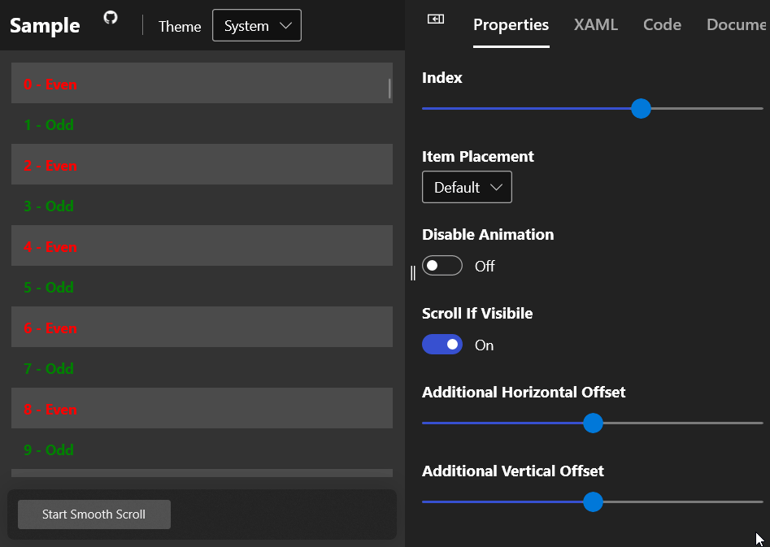

# ListViewExtensions

[ListViewExtensions](https://docs.microsoft.com/dotnet/api/microsoft.toolkit.uwp.ui.extensions.listviewextensions) provide a lightweight way to extend every control that inherits the [ListViewBase](https://docs.microsoft.com/uwp/api/Windows.UI.Xaml.Controls.ListViewBase) class with attached properties.

> [!div class="nextstepaction"]
> [Try it in the sample app](uwpct://Extensions?sample=ListViewExtensions)

## ListViewBase Extentions

- [AlternateColor Extentions](#alternatecolor-extentions)
- [AlternateItemTemplate Extentions](#alternateitemtemplate-extentions)
- [Command Extentions](#command-extentions)
- [StretchItemContainerDirection Extentions](#stretchitemcontainerdirection-extentions)
- [SmoothScrollIntoView Helper](#smoothscrollintoview-helper)

## AlternateColor extentions

The AlternateColor property provides a way to assign a background color to every other item.

> [!WARNING]
> The [ContainerContentChanging](https://docs.microsoft.com/uwp/api/windows.ui.xaml.controls.listviewbase#Windows_UI_Xaml_Controls_ListViewBase_ContainerContentChanging) event used for this extension to work, will not be raised when the ItemsPanel is replaced with another type of panel than ItemsStackPanel or ItemsWrapGrid. 

### Syntax

```xaml
<Page ...
     xmlns:extensions="using:Microsoft.Toolkit.Uwp.UI.Extensions">

<ListView
    extensions:ListViewExtensions.AlternateColor="Silver"
    ItemsSource="{x:Bind MainViewModel.Items, Mode=OneWay}" />
```

### Properties

| Property | Description |
| --| -- |
| AlternateColor | Attached `DependencyProperty` for binding a `Brush` as an alternate background color to a `ListViewBase` |

## AlternateItemTemplate extentions

The AlternateItemTemplate property provides a way to assign an alternate [datatemplate](https://docs.microsoft.com/uwp/api/windows.ui.xaml.datatemplate) to every other item. It is also possible to combine with the AlternateColor property.

> [!WARNING]
> The [ContainerContentChanging](https://docs.microsoft.com/uwp/api/windows.ui.xaml.controls.listviewbase#Windows_UI_Xaml_Controls_ListViewBase_ContainerContentChanging) event used for this extension to work, will not be raised when the ItemsPanel is replaced with another type of panel than ItemsStackPanel or ItemsWrapGrid.

### Syntax

```xaml
<Page ...
     xmlns:extensions="using:Microsoft.Toolkit.Uwp.UI.Extensions">

<Page.Resources>
    <DataTemplate x:Name="NormalTemplate">
        <TextBlock Text="{Binding " Foreground="Green"></TextBlock>
    </DataTemplate>
    
    <DataTemplate x:Name="AlternateTemplate">
        <TextBlock Text="{Binding}" Foreground="Orange"></TextBlock>
    </DataTemplate>
</Page.Resources>

<ListView
    ItemTemplate="{StaticResource NormalTemplate}"
    extensions:ListViewExtensions.AlternateItemTemplate="{StaticResource AlternateTemplate}"
    ItemsSource="{x:Bind MainViewModel.Items, Mode=OneWay}" />
```

### Properties

| Property | Description |
| --| -- |
| AlternateItemTemplate | Attached `DependencyProperty` for binding a `DataTemplate` as an alternate template to a `ListViewBase` |

## Command extentions

ListViewExtensions provides extension method that allow attaching [ICommand](https://docs.microsoft.com/uwp/api/Windows.UI.Xaml.Input.ICommand) to handle ListViewBase Item interaction by means of [ItemClick](https://docs.microsoft.com/uwp/api/windows.ui.xaml.controls.listviewbase#Windows_UI_Xaml_Controls_ListViewBase_ItemClick) event.

> [!IMPORTANT]
> ListViewBase [IsItemClickEnabled](https://docs.microsoft.com/uwp/api/windows.ui.xaml.controls.listviewbase#Windows_UI_Xaml_Controls_ListViewBase_IsItemClickEnabled) must be set to `true`

### Syntax

```xaml
<Page ...
     xmlns:extensions="using:Microsoft.Toolkit.Uwp.UI.Extensions">
     
<ListView
    extensions:ListViewExtensions.Command="{x:Bind MainViewModel.ItemSelectedCommand, Mode=OneWay}"
    IsItemClickEnabled="True"
    ItemsSource="{x:Bind MainViewModel.Items, Mode=OneWay}"
    SelectionMode="None" />
```

### Properties

| Property | Description |
| --| -- |
| Command | Attached `DependencyProperty` for binding an `ICommand` instance to a `ListViewBase` |

## StretchItemContainerDirection extentions

The StretchItemContainerDirection property provides a way to stretch the ItemContainer in horizontal, vertical or both ways. Possible values for this property are *Horizontal*, *Vertical* and *Both*.

> [!WARNING]
> The [ContainerContentChanging](https://docs.microsoft.com/uwp/api/windows.ui.xaml.controls.listviewbase#Windows_UI_Xaml_Controls_ListViewBase_ContainerContentChanging) event used for this extension to work, will not be raised when the ItemsPanel is replaced with another type of panel than `ItemsStackPanel` or `ItemsWrapGrid`.

### Syntax

```xaml
<Page ...
     xmlns:extensions="using:Microsoft.Toolkit.Uwp.UI.Extensions">

<ListView
    extensions:ListViewExtensions.StretchItemContainerDirection="Horizontal"
    ItemsSource="{x:Bind MainViewModel.Items, Mode=OneWay}" />
```

### Properties

| Property | Type | Description |
| --| -- | -- |
| StretchItemContainerDirection | [ListViewBase.StretchDirection](https://docs.microsoft.com/dotnet/api/microsoft.toolkit.uwp.ui.extensions.listviewbase.stretchdirection) | Attached `DependencyProperty` for setting the container content stretch direction on the `ListViewBase` |

# SmoothScrollIntoView Helper

Use SmoothScrollIntoView helps to scroll the item into the view with animation. Specify the ItemPosition property to align the item.

## Syntax

**C#**

```csharp
// Scrolling with index
await MyGridView.SmoothScrollIntoViewWithIndex(index: int, itemPlacement: ItemPlacement, disableAnimation: bool, scrollIfVisibile: bool, additionalHorizontalOffset: int, additionalVerticalOffset: int);

// Scrolling with item
await MyGridView.SmoothScrollIntoViewWithItem(item: object, itemPlacement: ItemPlacement, disableAnimation: bool, scrollIfVisibile: bool, additionalHorizontalOffset: int, additionalVerticalOffset: int);
```
```vb
' Scrolling with index
Await MyGridView.SmoothScrollIntoViewWithItem(index:=Integer, itemPlacement:=ItemPlacement.Bottom, disableAnimation:=Boolean, scrollIfVisibile:=Boolean, additionalHorizontalOffset:=Integer, additionalVerticalOffset:=Integer)

' Scrolling with item
Await MyGridView.SmoothScrollIntoViewWithItem(item:=Object, itemPlacement:=ItemPlacement.Bottom, disableAnimation:=Boolean, scrollIfVisibile:=Boolean, additionalHorizontalOffset:=Integer, additionalVerticalOffset:=Integer)
```

## Sample Output



## Methods

| Methods | Return Type | Description |
| -- | -- | -- |
| SmoothScrollIntoViewWithIndex(int, ItemPlacement, bool, bool, int, int) | Task | Smooth scroll item into view With index number |
| SmoothScrollIntoViewWithItem(object, ItemPlacement, bool, bool, int, int) | Task | Smooth scroll item into view With item object |

> [!NOTE]
> Even though this return `Task`, it will not wait until the scrolling completes

## Method params

| Properties | Type | Description |
|------------|------|-------------|
| intex      | int  | Intex of the item to be scrolled |
| item      | int  | Intex of the item to be scrolled |
| itemPosition | Enum | Specify the position of the Item after scrolling |
| disableAnimation | bool | To disable the scrolling animation |
| scrollIfVisibile | bool | Set `true` to scroll even if the scroll to item is visible so that the item will be aligned depend upon `itemPosition` |
| additionalHorizontalOffset | bool | Give addition horizontal offset |
| additionalVerticalOffset | bool | Give addition vertical offset |

### ItemPosition

| ItemPosition | Description |
|--------------|-------------|
| Default | If visible then it will not scroll, if not then item will be aligned to the nearest edge |
| Left | Aligned left |
| Top | Aligned top |
| Centre | Aligned centre |
| Right | Aligned right |
| Bottom | Aligned bottom |

## Examples

- We can use this extension to make the selected item always centered.

    **Sample Code**
    
    ```xaml
    <ListView ItemsSource="{x:Bind itemSources}" SelectionChanged="ListView_SelectionChanged">
        <ListView.ItemTemplate>
            <DataTemplate>
                <!-- Your Template -->
            </DataTemplate>
        </ListView.ItemTemplate>
        <ListView.ItemsPanel>
            <ItemsPanelTemplate>
                <StackPanel Orientation="Horizontal"/>
            </ItemsPanelTemplate>
        </ListView.ItemsPanel>
    </ListView>
    ```

    ```csharp
    private async void ListView_SelectionChanged(object sender, SelectionChangedEventArgs e)
    {
        var listView = (sender as ListView);
        await listView.SmoothScrollIntoViewWithIndex(listView.SelectedIndex, ItemPlacement.Centre, false, true);
    }
    ```

    **Sample Output**

    

    For PopUp effect see [GridView selectedItem Popup](https://stackoverflow.com/a/44707177/7331395)

## Sample Project

[ListViewExtensions](https://github.com/windows-toolkit/WindowsCommunityToolkit/tree/master/Microsoft.Toolkit.Uwp.SampleApp/SamplePages/ListViewExtensions). You can [see this in action](uwpct://Extensions?sample=ListViewExtensions) in the [Windows Community Toolkit Sample App](http://aka.ms/uwptoolkitapp).

## Requirements

| Device family | Universal, 10.0.16299.0 or higher |
| --- | --- |
| Namespace | Microsoft.Toolkit.Uwp.UI.Extensions |
| NuGet package | [Microsoft.Toolkit.Uwp.UI](https://www.nuget.org/packages/Microsoft.Toolkit.Uwp.UI/) |

## API

* [ListViewExtensions source code](https://github.com/windows-toolkit/WindowsCommunityToolkit/tree/master/Microsoft.Toolkit.Uwp.UI/Extensions/ListViewBase)
