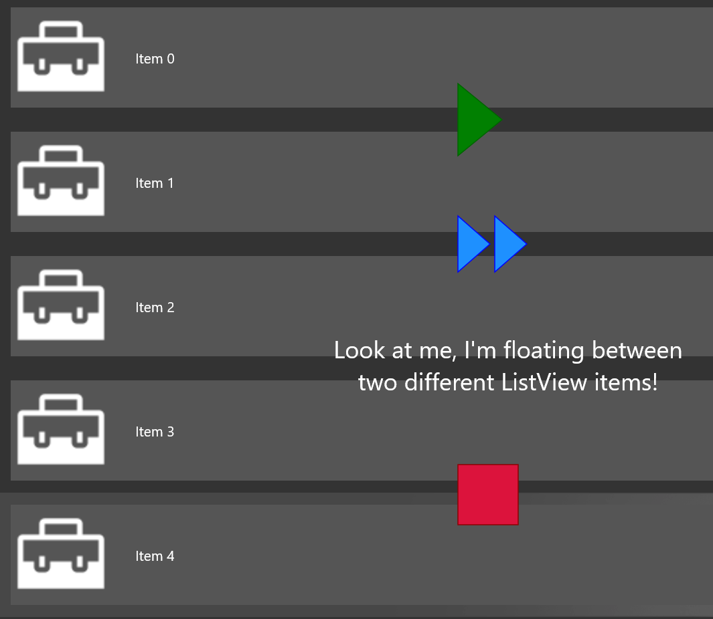

# ScrollViewer extensions

The [ScrollViewerExtensions](https://docs.microsoft.com/en-us/dotnet/api/microsoft.toolkit.uwp.ui.extensions.scrollviewerextensions) provide extension methods to improve your ScrollViewer implementation.

> [!div class="nextstepaction"]
> [Try it in the sample app](uwpct://Extensions?sample=ScrollViewerExtensions)

## ScrollBarMargin

The ScrollBarMargin property provides a way to assign a Thickness to the vertical/horizontal ScrollBar of your container.

### Syntax

```xaml
<ListView extensions:ScrollViewerExtensions.HorizontalScrollBarMargin="2, 2, 2, 2">
    <!-- ListView Item -->
</ListView>

<ListView extensions:ScrollViewerExtensions.VerticalScrollBarMargin="2, 2, 2, 2">
    <!-- ListView Item -->
</ListView>
```

### Attached Properties

| Property | Type | Description |
| -- | -- | -- |
| HorizontalScrollBarMargin | Thickness | Set `Thickness` of the horizontal ScrollBar of your container |
| VerticalScrollBarMargin | Thickness | Set `Thickness` of the vertical ScrollBar of your container |

### Example

```xaml
<ListView Name="listView"
            extensions:ScrollViewerExtensions.VerticalScrollBarMargin="{Binding MinHeight, ElementName=MyHeaderGrid, Converter={StaticResource DoubleTopThicknessConverter}}">
        <ListView.Header>
            <controls:ScrollHeader Mode="Sticky">
                <Grid x:Name="MyHeaderGrid"
                        MinHeight="100"
                        Background="{ThemeResource SystemControlAccentAcrylicElementAccentMediumHighBrush}">
                    <StackPanel HorizontalAlignment="Center"
                                VerticalAlignment="Center">
                        <TextBlock Margin="12"
                                    FontSize="48"
                                    FontWeight="Bold"
                                    Foreground="{StaticResource Brush-White}"
                                    Text="Scroll Header"
                                    TextAlignment="Center"
                                    TextWrapping="WrapWholeWords" />
                    </StackPanel>
                </Grid>
            </controls:ScrollHeader>
        </ListView.Header>
        ...
</ListView>
```

The converter is used to just bind to top margin, moving only the ScrollBar's top end.

```c#
class DoubleTopThicknessConverter : IValueConverter
{
    public object Convert(object value, Type targetType, object parameter, string language)
    {
        return new Thickness(0, (double)value, 0, 0);
    }

    public object ConvertBack(object value, Type targetType, object parameter, string language)
    {
        return ((Thickness)value).Top;
    }
}
```

## MiddleClickScrolling

MiddleClickScrolling allows you to scroll by click middle mouse button (scroll wheel button) and move the pointer of the direction to be scrolled. This extension method can be used directly in `ScrollViewer` or ancestor of `ScrollViewer`.

### Syntax

```xaml
<!-- Setting MiddleClickScrolling directely for ScrollViewer -->
<ScrollViewer extensions:ScrollViewerExtensions.EnableMiddleClickScrolling="True">
    <!-- ScrollViewer Content -->
</ScrollViewer>

<!-- Setting MiddleClickScrolling fot the ancestor of ScrollViewer -->
<ListView extensions:ScrollViewerExtensions.EnableMiddleClickScrolling="True">
    <!-- ListView Item -->
</ListView>
```

### Sample Output


### Changing Cursor Type

> [!IMPORTANT]
> Resource file must be manually added to change the cursor type when middle click scrolling. If you didn't add then the cursor won't change when middle click scrolling but functionality won't be affected.

#### Using Existing Resource File

1. Download [MiddleClickScrolling-CursorType.res](https://github.com/Microsoft/WindowsCommunityToolkit//tree/master/Microsoft.Toolkit.Uwp.UI/Extensions/ScrollViewer/MiddleClickScrolling-CursorType.res) file
2. Move this file into your project's folder
2. Open .csproj file of your project in [Visual Studio Code](https://code.visualstudio.com/) or in any other code editor
3. Add `<Win32Resource>MiddleClickScrolling-CursorType.res</Win32Resource>` in the first `<PropertyGroup>`

### Edit Existing Resource File

You can easily edit the existing resource file to customize the cursor depending upon your needs.

1. Follow the above steps to add the resource file
2. Open MiddleClickScrolling-CursorType.res file in Visual Studio
3. Open Cursor folder
4. Now you can edit the cursor by opening 101, 102, ....., 109

### Attached Properties

| Property | Type | Description |
| -- | -- | -- |
| EnableMiddleClickScrolling | bool | Set `true` to enable middle click scrolling |

## Expression animations

The `StartExpressionAnimation` methods provide a way to easily start a composition expression animation to sync a `ScrollViewer` instance with another control. This binds the manipulation status on a `ScrollViewer` property set with either the translation or the offset of another visual element, to follow or mirror the motion in the source `ScrollViewer`.

### Example

```xml
<Grid>

    <!--This is a ListView we can use to display a series of items. It will
        contain the ScrollViewer that will be targeted by the expression animation.-->
    <ListView Name="listView">
      <ListView.ItemTemplate>
        <DataTemplate>
            <Image Width="100"
                   Height="100"
                   Source="ms-appx:///Assets/ToolkitLogo.png" />
        </DataTemplate>
      </ListView.ItemTemplate>
    </ListView>

    <!--This is the panel that will be animated in sync with the main ScrollViewer control
        inside the ListView in the page, using the ScrollViewerExtensions leveraging composition
        ExpressionAnimations. Note how the panel is not inside the ListView, but it's just
        rendering "fixed" items right on top of the ListView. We can use the expression animation
        to "bind" the scrolling of the ListView and keep the panel "in sync" with it.-->
    <StackPanel x:Name="shapesPanel">
      <Polygon Height="100"
               Width="100"
               Points="0,0 0,72 44,36"
               Stroke="DarkGreen"
               Fill="Green"
               VerticalAlignment="Center"
               HorizontalAlignment="Center"/>
    </StackPanel>
  </Grid>
```

```csharp
using Microsoft.Toolkit.Uwp.UI.Extensions;

ScrollViewer scrollViewer = listView.FindDescendant<ScrollViewer>();

// Binds the Y scroll axis of the ScrollViewer to the Y translation axis of the target
listScrollViewer.StartExpressionAnimation(shapesPanel, Axis.Y);

// It is also possible to synchronize different axes, as well as targeting
// different Visual properties. By default, the expression works with the
// Visual.Translate property, but Visual.Offset can be used as well.
listScrollViewer.StartExpressionAnimation(shapesPanel, Axis.X, Axis.Y, VisualProperty.Offset);
```

### Sample output



## Sample Project

[ScrollViewerExtensions sample page Source](https://github.com/Microsoft/WindowsCommunityToolkit//tree/master/Microsoft.Toolkit.Uwp.SampleApp/SamplePages/ScrollViewerExtensions). You can [see this in action](uwpct://Extensions?sample=ScrollViewerExtensions) in the [Windows Community Toolkit Sample App](http://aka.ms/uwptoolkitapp).

## Requirements

| Device family | Universal, 10.0.16299.0 or higher |
| -- | -- |
| Namespace | Microsoft.Toolkit.Uwp.UI.Extensions |
| NuGet package | [Microsoft.Toolkit.Uwp.UI](https://www.nuget.org/packages/Microsoft.Toolkit.Uwp.UI/) |

## API

* [ScrollViewerExtensions source code](https://github.com/Microsoft/WindowsCommunityToolkit//tree/master/Microsoft.Toolkit.Uwp.UI/Extensions/ScrollViewer)
