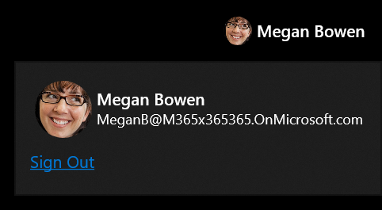

# LoginButton XAML Control

The [LoginButton](/dotnet/api/microsoft.toolkit.graph.controls.loginbutton) is both a button and flyout control to facilitate Microsoft identity platform authentication. It provides two states:

* When the user is not signed in, the control is a simple button to initiate the sign in process.
* When the user is signed in, the control displays the current signed in user name, profile image, and email. When clicked, a flyout is opened with a command to sign out.

> [!div class="nextstepaction"]
> [Try it in the sample app](uwpct://controls?sample=LoginButton)

## Syntax

```xaml
  <wgt:LoginButton/>
```

## Sample Output



## Properties

| Property | Type | Description |
| -- | -- | -- |
| UserDetails | User | Gets or sets details about this person retrieved from the graph or provided by the developer. |
| IsLoading | bool | Indicates if the control is loading and hasn't established a sign-in state. |

## Events

| Events | Description |
| -- | -- |
| LoginInitiated | The user clicked the sign in button to start the login process. |
| LoginCompleted | The login process was successful and the user is now signed in. |
| LoginFailed | The user canceled the login process or was unable to sign in. |
| LogoutInitiated | The user started to logout. |
| LogoutCompleted | The user signed out. |

## Sample Project

[LoginButton sample page Source](https://github.com/windows-toolkit/WindowsCommunityToolkit/tree/rel/7.0.0/Microsoft.Toolkit.Uwp.SampleApp/SamplePages/LoginButton). You can [see this in action](uwpct://Controls?sample=LoginButton) in [Windows Community Toolkit Sample App](https://aka.ms/windowstoolkitapp).

## Requirements

| Device family | Universal, MinVersion or higher |
| -- | -- |
| Namespace | Microsoft.Toolkit.Graph.Controls |
| NuGet package | [Microsoft.Toolkit.Graph.Controls](https://www.nuget.org/packages/Microsoft.Toolkit.Graph.Controls) |

## API

* [LoginButton source code](https://github.com/windows-toolkit/Graph-Controls/tree/rel/7.0.0/Microsoft.Toolkit.Graph.Controls/Controls/LoginButton)

## Related Topics

* [User Graph API](/graph/api/resources/user?view=graph-rest-beta)
* [MGT Login Component](/graph/toolkit/components/login)
