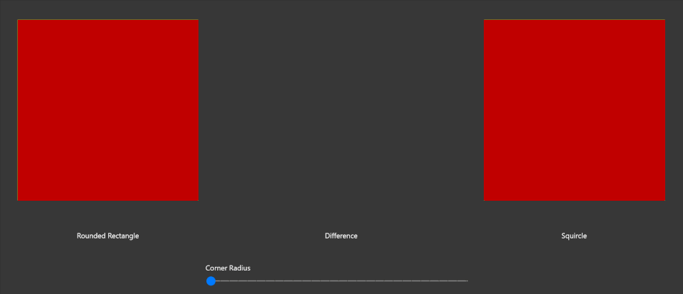

---
title:
author: ratishphilip
description: describe your control in one sentence
keywords: windows 10, uwp, windows community toolkit, uwp community toolkit, uwp toolkit, win2d, win2d path mini language
dev_langs:
  - csharp
---

# CanvasPathGeometry

The `CanvasGeometry` class (in the `Microsoft.Graphics.Canvas.Geometry` namespace) facilitates the drawing and manipulation of complex geometrical shapes. These shapes can be outlined with a stroke and filled with a brush (which can be a solid color, a bitmap pattern, or a gradient).

While the `CanvasGeometry` class provides various static methods to create predefined shapes like Circle, Ellipse, Rectangle, RoundedRectangle, the `CanvasPathBuilder` class provides several methods to create freeform CanvasGeometry objects.

Creation of a complex freeform geometric shape may involve invoking of several CanvasPathBuilder commands. For example, the following code shows how to create a triangle geometry using CanvasPathBuilder

```cs
CanvasPathBuilder pathBuilder = new CanvasPathBuilder(device);
pathBuilder.BeginFigure(1, 1);
pathBuilder.AddLine(300, 300);
pathBuilder.AddLine(1, 300);
pathBuilder.EndFigure(CanvasFigureLoop.Closed);
CanvasGeometry triangleGeometry = CanvasGeometry.CreatePath(pathBuilder);
```

**Win2d Path Mini Language** is a powerful and sophisticated language based on the [SVG Path language](https://www.w3.org/TR/SVG11/paths.html) specification. It facilitates specifying complex geometries, color, brushes, strokes, and stroke styles in a more compact manner.

[More details about Win2d Path Mini Language](https://raw.githubusercontent.com/MicrosoftDocs/WindowsCommunityToolkitDocs/master/docs/parsers/Win2d_Path_Mini_Language.md)

The `CanvasPathGeometry` class provides several static methods that parse the Win2d Mini Language and instantiate the complex geometries, color, brushes, strokes, and stroke styles. This class is available in the `Microsoft.Toolkit.Uwp.UI.Media.Geometry` namespace.

Using Win2d Path Mini Language, the geometry in the above example can be created in the following way

```cs
string pathData = “M 1 1 300 300 1 300 Z”;
CanvasGeometry triangleGeometry = CanvasPathGeometry.CreateGeometry(device, pathData);
```

> [!div class="nextstepaction"][try it in the sample app](uwpct://Helpers?sample=CanvasPathGeometryPage)

## Sample Project

<!-- Link to the sample page in the Windows Community Toolkit Sample App -->

[CanvasPathGeometry Sample Page Source](https://github.com/windows-toolkit/WindowsCommunityToolkit/blob/master/Microsoft.Toolkit.Uwp.SampleApp/SamplePages/CanvasPathGeometry/CanvasPathGeometryPage.xaml.cs). You can [see this in action](uwpct://Helpers?sample=CanvasPathGeometryPage) in [Windows Community Toolkit Sample App](http://aka.ms/uwptoolkitapp).

## Requirements

| Device family | Universal, MinVersion or higher                                                                  |
| ------------- | ------------------------------------------------------------------------------------------------ |
| Namespace     | Microsoft.Toolkit.Uwp.UI.Media.Geometry                                                          |
| NuGet package | [Microsoft.Toolkit.Uwp.UI.Media](https://www.nuget.org/packages/Microsoft.Toolkit.Uwp.UI.Media/) |

## API

- [CanvasPathGeometry](https://github.com/windows-toolkit/WindowsCommunityToolkit/blob/master/Microsoft.Toolkit.Uwp.UI.Media/Geometry/CanvasPathGeometry.cs)

### Creating CanvasGeometry with CanvasPathGeometry

The following APIs convert path data string to CanvasGeometry

```cs
public static CanvasGeometry CreateGeometry(ICanvasResourceCreator resourceCreator, string pathData, StringBuilder logger = null);
public static CanvasGeometry CreateGeometry(string pathData, StringBuilder logger = null);
```

The **logger** parameter in this method is an option argument of type **StringBuilder** that can be used to obtain the **CanvasPathBuilder** commands in text format. It is mainly intended for information/debugging purposes only.

### Creating Color

#### From Hexadecimal Color String or High Dynamic Range Color String

There are two APIs that convert the hexadecimal color string in **#RRGGBB** or **#AARRGGBB** format or the High Dynamic Range Color string in the **R G B A** format to the corresponding Color object. The '#' character is optional in Hexadecimal color string. R, G, B & A should have value in the range between 0 and 1, inclusive.

```cs
public static Color CreateColor(string colorString);
public static bool TryCreateColor(string colorString , out Color color);
```

The first API will raise an **ArgumentException** if the argument is not in the correct format while the second API will attempt to convert the color string without raising an exception.

Example

```cs
var redColor = CanvasPathGeometry.CreateColor("#ff0000");
CanvasPathGeometry.TryCreateColor("0000ff", out Color blueColor);

try
{
  // throws ArgumentException
  var invalidColor = CanvasPathGeometry.CreateColor("xyz");
}
catch (ArgumentException)
{

}
```

#### From High Dynamic Range Color (Vector4)

The following API Converts a **Vector4** High Dynamic Range Color to Color object. Negative components of the Vector4 will be sanitized by taking the absolute value of the component. The HDR Color components should have value in the range [0, 1]. If their value is more than 1, they will be clamped at 1. **Vector4** 's X, Y, Z, W components match to **Color**'s R, G, B, A components respectively.

```cs
public static Color CreateColor(Vector4 hdrColor);
```

Example

```cs
var hdrVector = new Vector4(1, 0, 0, 1);
// Red color
var redColor = CanvasPathGeometry.CreateColor(hdfVector);
```

### Creating ICanvasBrush

The following API converts a brush data string to **ICanvasBrush** object

```cs
public static ICanvasBrush CreateBrush(ICanvasResourceCreator resourceCreator,
string brushData);
```

Example

```cs
// SolidColorBrush with 0.75 opacity
var solidRedBrush = CanvasPathGeometry.CreateBrush(device, "SC #FFFF0000 O 0.75");
// LinearGradientBrush
var linearGradientBrush = CanvasPathGeometry.CreateBrush(device, “LG M 0 80 Z0 0 S 0.00 #ffee5124, 0.18 #fff05627, 0.26 #fff15b29, 0.6 #fff58535, 1.00 #fff9af41”);
```

### Creating CanvasStrokeStyle

The following API converts a style data string to **CanvasStrokeStyle** object

```cs
public static CanvasStrokeStyle CreateStrokeStyle(string styleData);
```

Example

```cs
// CanvasStrokeStyle with custom dash style
var customStrokeStyle = CanvasPathGeometry.CreateStrokeStyle(“CSS CDS 2 2 0 2 1 3”);
```

### Creating ICanvasStroke

**ICanvasStroke** is an interface to represent the Stroke which can be used to render an outline on a **CanvasGeometry**. **CanvasStroke** class implements this interface.

```cs
public interface ICanvasStroke
{
    ICanvasBrush Brush { get; }
    float Width { get; }
    CanvasStrokeStyle Style { get; }
    Matrix3x2 Transform { get; set; }
}

public sealed class CanvasStroke : ICanvasStroke
{
    public ICanvasBrush Brush { get; }
    public float Width { get; }
    public CanvasStrokeStyle Style { get; }
    public Matrix3x2 Transform { get; set; }

    public CanvasStroke(ICanvasBrush brush, float strokeWidth = 1f);
    public CanvasStroke(ICanvasBrush brush, float strokeWidth, CanvasStrokeStyle strokeStyle);
    public CanvasStroke(ICanvasResourceCreator device, Color strokeColor, float strokeWidth = 1f);
    public CanvasStroke(ICanvasResourceCreator device, Color strokeColor, float strokeWidth, CanvasStrokeStyle strokeStyle);
}
```

The following API converts a stroke data string to **ICanvasStroke** object

```cs
public static ICanvasStroke CreateStroke(ICanvasResourceCreator resourceCreator, string strokeData);
```

Example

```cs
// A dashed stroke rendered with a LinearGradientBrush and a custom stroke style
var dashedStroke = CanvasPathGeometry.CreateStroke(device, “ST 4.5 LG M 0 0 Z80 80 S 0.00 #ffff0000, 0.5 #ff00ff00, 0.99 #ff0000ff CSS DS 2 Do 2 SC 1 EC 2 CDS 2 2 0 2 1 3”);
// A solid line stroke of thickness 2 having red color
var solidStroke = CanvasPathGeometry.CreateStroke(device, “ST 2 SC #ff0000”);
```

### Compositor Extension Methods

Based on the above methods, the following extension methods for **Compositor** are now available

```cs
public static CompositionPath CreatePath(this Compositor compositor, string pathData);
public static CompositionPathGeometry CreatePathGeometry(this Compositor compositor, string pathData);
public static CompositionSpriteShape CreateSpriteShape(this Compositor compositor, string pathData);
public static CompositionGeometricClip CreateGeometricClip(this Compositor compositor, CanvasGeometry geometry);
public static CompositionGeometricClip CreateGeometricClip(this Compositor compositor, string pathData);
```

### Creating a Squircle

A [Squircle](https://en.wikipedia.org/wiki/Squircle) is an intermediate shape between a square and a circle.



The following extension methods help to create a Squircle in Composition layer or using Win2d.

```cs
// CanvasPathGeometry
public static CanvasGeometry CreateSquircle(ICanvasResourceCreator resourceCreator, float x, float y, float width, float height, float radiusX, float radiusY);
// CanvasPathBuilder extension method
public static void AddSquircleFigure(this CanvasPathBuilder pathBuilder, float x, float y, float width, float height, float radiusX, float radiusY);
// CanvasDrawingsession extension methods
public static void DrawSquircle(this CanvasDrawingSession session, float x, float y, float w, float h, float radiusX, float radiusY, ICanvasStroke stroke);
public static void DrawSquircle(this CanvasDrawingSession session, float x, float y, float w, float h, float radiusX, float radiusY, Vector2 offset, ICanvasStroke stroke);
public static void FillSquircle(this CanvasDrawingSession session, float x, float y, float w, float h, float radiusX, float radiusY, Color color);
public static void FillSquircle(this CanvasDrawingSession session, float x, float y, float w, float h, float radiusX, float radiusY, ICanvasBrush brush);
public static void FillSquircle(this CanvasDrawingSession session, float x, float y, float w, float h, float radiusX, float radiusY, Vector2 offset, Color color);
public static void FillSquircle(this CanvasDrawingSession session, float x, float y, float w, float h, float radiusX, float radiusY, Vector2 offset, ICanvasBrush brush);
```
